# BOI Mule Account Detection System — Enterprise Technical Documentation

**Version:** 3.1  
**Date:** 2026-06-14  
**Classification:** Internal — Confidential  
**Standards:** ISO 27001, IEEE 830, OWASP Top 10, NIST AI RMF, TOGAF, C4 Model  

---

## Table of Contents

1. [Executive Summary](#1-executive-summary)
2. [Gap Analysis](#2-gap-analysis)
3. [Risk Register](#3-risk-register)
4. [Business Architecture](#4-business-architecture)
5. [Functional Decomposition](#5-functional-decomposition)
6. [Process Flow Diagrams](#6-process-flow-diagrams)
7. [C4 Architecture Documentation](#7-c4-architecture-documentation)
8. [Data Model and Data Lineage Documentation](#8-data-model-and-data-lineage-documentation)
9. [Dependency and Library Documentation](#9-dependency-and-library-documentation)
10. [Security and Zero Trust Documentation](#10-security-and-zero-trust-documentation)
11. [API Documentation](#11-api-documentation)
12. [AI / LLM / Agentic Architecture](#12-ai--llm--agentic-architecture)
13. [System Requirements Specification](#13-system-requirements-specification)
14. [QA, Reliability, and Chaos Engineering Plan](#14-qa-reliability-and-chaos-engineering-plan)
15. [Sustainability Architecture](#15-sustainability-architecture)
16. [Investor Deck Outline](#16-investor-deck-outline)
17. [Immediate Action Plan](#17-immediate-action-plan)
18. [Assumptions and Inferred Strategies](#18-assumptions-and-inferred-strategies)

---

# 1. Executive Summary

## 1.1 System Purpose

`[OBSERVED: The BOI Mule Account Detection System is an end-to-end machine learning solution built for the Bank of India (BOI) PSB Cybersecurity, Fraud & AI Hackathon. It detects mule accounts using a model zoo (LightGBM, XGBoost, CatBoost, RF, ExtraTrees, DecisionTree, LR, MLP, Stacking) with auto-selected production model (currently XGBoost), Isolation Forest anomaly detection, TypologyEngine rule tags, four-level suspicion scoring, and SHAP explainability. Outputs include decision (BLOCK/CHALLENGE/REVIEW/APPROVE), suspicion_level (1–4), typology_flags, and adjusted_fused_risk_score.]`

## 1.2 Business Impact

- **Problem:** Mule accounts are used by fraud networks to launder money. Traditional rule-based systems miss novel typologies.
- **Solution:** A defense-in-depth ML pipeline that catches both known patterns (supervised) and novel anomalies (unsupervised), fused into a single actionable risk score.
- **Decision Framework:** Four-tier action matrix with configurable policy presets (strict / balanced / loose) and investigator manual overrides.

## 1.3 Technical Summary

| Dimension | Detail |
|:--|:--|
| **Primary Model** | XGBoost (auto-selected; `models/best_model.pkl`) |
| **Anomaly Layer** | Isolation Forest (semi-supervised, trained on legitimate accounts only) |
| **Typology Layer** | TypologyEngine (silent_account, large_amount_mover, instant_mule, aggregator_hub) |
| **Fusion Formula** | 70% supervised probability + 30% anomaly score; typology boost max +0.10 |
| **Holdout PR-AUC** | `[OBSERVED: 0.888]` |
| **Holdout ROC-AUC** | `[OBSERVED: 0.999]` |
| **Precision @ optimal threshold** | `[OBSERVED: 0.778 @ recall 0.875]` |
| **Recall @ FPR 1%** | `[OBSERVED: 1.000]` |
| **Precision-optimal threshold** | `[OBSERVED: 0.10]` |
| **Feature Count** | `[OBSERVED: 3,923 raw → 266 engineered after pipeline]` |
| **Dataset Size** | `[OBSERVED: ~111 MB, Git-LFS tracked]` |
| **API** | `[OBSERVED: FastAPI, 10+ endpoints incl. /alerts/suspicious-list, batch up to 200K accounts]` |
| **Frontend** | `[OBSERVED: Single-page HTML/CSS/JS, glassmorphism dark UI]` |
| **Deployment** | `[OBSERVED: Docker container, uvicorn ASGI server]` |
| **CI/CD** | `[OBSERVED: GitHub Actions — lint (ruff), test (pytest), LFS verification]` |

## 1.4 Key Stakeholders

| Role | Relevance |
|:--|:--|
| Bank Fraud Investigators | Primary users of scoring and override controls |
| Compliance Officers | Decision audit trail and regulatory reporting |
| Technology Team | Model retraining, API ops, feature pipeline |
| Executive Leadership | ROI, risk posture, regulatory readiness |

---

# 2. Gap Analysis

## 2.1 Completeness Assessment

| Category | Check | Status | Gap Description |
|:--|:--|:--|:--|
| Business | Clear objective defined | ✅ | `[OBSERVED: Mule account detection for BOI hackathon, target F3924]` |
| Business | Monetization model documented | ⚠️ | `[MISSING: No revenue model documented — hackathon context implies internal tool]` |
| Architecture | ADRs exist | ❌ | `[MISSING: No Architecture Decision Records found in repository]` |
| Security | Authentication and authorization documented | ❌ | `[OBSERVED: No authentication on any API endpoint. CORS allows all origins (*)]` |
| Engineering | Error handling strategy defined | ✅ | `[OBSERVED: Global exception handler returns JSON 500. Endpoint-level try/catch in /score]` |
| Engineering | Validation and retry logic specified | ⚠️ | `[OBSERVED: Pydantic validation on inputs. No retry logic on scoring]` |
| Engineering | Rollback or compensation logic documented | ❌ | `[MISSING: No rollback mechanism for overrides or scoring. In-memory state lost on restart]` |
| Operations | Observability standards established | ⚠️ | `[OBSERVED: Python logging to stdout only. No structured logging, no metrics export]` |
| Operations | Logging and alerting configured | ❌ | `[MISSING: No alerting, no log aggregation, no health monitoring beyond /health]` |
| API | Schema and contract defined | ✅ | `[OBSERVED: Pydantic models define request/response schemas. FastAPI auto-generates OpenAPI docs]` |
| Data | Normalization strategy documented | ✅ | `[OBSERVED: RobustScaler for anomaly, StandardScaler for LR, QuantileTransformer for skewed features]` |
| Data | Indexing strategy specified | ❌ | `[MISSING: No database — all data is in CSV/Parquet files and in-memory]` |
| Data | Lineage documented | ✅ | `[OBSERVED: PROJECT_ARCHITECTURE.md traces data from DataSet.csv → engineered → models → API]` |
| DevOps | Deployment architecture defined | ✅ | `[OBSERVED: Dockerfile with Python 3.11-slim, uvicorn entrypoint]` |
| DevOps | Environment promotion model documented | ❌ | `[MISSING: No staging or production environments defined. Single environment only]` |
| Governance | Dependency governance in place | ⚠️ | `[OBSERVED: requirements.txt exists but no lockfile (pip freeze). Many optional deps commented out]` |
| Quality | Test strategy defined | ⚠️ | `[OBSERVED: Two smoke test scripts (test_score.py, test_batch.py). No pytest unit tests]` |
| Reliability | SLOs and SLIs defined | ❌ | `[MISSING: No SLOs/SLIs defined. < 100ms target mentioned in docstring only]` |
| Resilience | Chaos testing approach documented | ❌ | `[MISSING: No resilience or chaos testing]` |
| AI | AI governance and evaluation framework defined | ⚠️ | `[OBSERVED: SHAP explainability exists. No model card, no drift monitoring implemented]` |
| Cloud | Multi-cloud or exit strategy considered | ❌ | `[MISSING: No cloud deployment strategy. Docker provides portability]` |
| Sustainability | Carbon or energy footprint considered | ❌ | `[MISSING: No sustainability considerations documented]` |

## 2.2 Consistency Validation

| Validation Area | Finding |
|:--|:--|
| UI flows ↔ backend workflows | `[OBSERVED: Frontend calls /model/info, /score/batch, /score, /explain/{id}, /decision/policy, /decision/override — all match backend routes]` |
| API contracts ↔ frontend consumption | `[OBSERVED: Frontend builds feature payloads matching Pydantic TransactionFeatures schema. Feature alignment via /model/info]` |
| Data model ↔ business rules | `[OBSERVED: Decision thresholds in serving/app.py match blueprint Section 9 four-tier matrix. Three policy presets are consistent]` |
| CI/CD ↔ deployment | `[OBSERVED: CI runs ruff + pytest on ubuntu-latest. Dockerfile uses Python 3.11-slim. Consistent]` |
| Declared dependencies ↔ system goals | `[RISK: requirements.txt includes shap>=0.44.0 but serving/app.py does not use SHAP library at runtime — it uses a manual contribution calculation]` |
| Security claims ↔ implementation | `[RISK: No security claims made, and implementation confirms zero authentication. CORS wildcard (*). No rate limiting]` |
| Business capabilities ↔ technical components | `[OBSERVED: Blueprint describes 5 phases exactly matching 5 notebook scripts + serving layer]` |

---

# 3. Risk Register

| Risk ID | Category | Description | Severity | Likelihood | Impact | Mitigation |
|:--|:--|:--|:--|:--|:--|:--|
| R-001 | Security | No authentication or authorization on any API endpoint | 🔴 Critical | High | Critical | `[INFERRED STRATEGY: Implement JWT/OAuth2 + API key authentication before any production deployment]` |
| R-002 | Security | CORS allows all origins (`*`) | 🔴 Critical | High | High | Restrict to known frontend domains |
| R-003 | Security | No rate limiting on scoring endpoints | 🟠 High | Medium | High | Add rate limiting middleware (e.g., slowapi) |
| R-004 | Data | Manual overrides stored in-memory only — lost on restart | 🟠 High | High | Medium | Persist overrides to database (PostgreSQL/Redis) |
| R-005 | Data | Scored accounts cache capped at 1,000 entries — explain fails for evicted entries | 🟡 Medium | Medium | Medium | Use external cache (Redis) or database |
| R-006 | Resilience | No database — all state is ephemeral | 🟠 High | High | High | `[INFERRED STRATEGY: Add PostgreSQL for audit trail, Redis for cache]` |
| R-007 | Model | Threshold calibrated on holdout (`precision_optimal_threshold=0.10`) | 🟢 Low | Low | Low | `[OBSERVED: Precision 0.778 @ recall 0.875 on holdout; F1 threshold 0.18 retained for comparison]` |
| R-008 | Model | No model drift monitoring implemented | 🟡 Medium | Medium | High | Implement PSI monitoring per blueprint Section 11 |
| R-009 | Model | SHAP explainability implemented via TreeExplainer | 🟢 Low | Low | Low | `[OBSERVED: /explain/{id} uses real SHAP TreeExplainer on best_model.pkl]` |
| R-010 | Operations | No structured logging or metrics export | 🟡 Medium | High | Medium | Add JSON logging + Prometheus metrics |
| R-011 | Operations | No health check beyond basic /health — no readiness/liveness probes for k8s | 🟡 Medium | Medium | Medium | Add readiness probe checking model artifact availability |
| R-012 | Compliance | No audit trail for scoring decisions | 🟠 High | High | High | `[INFERRED STRATEGY: Log all decisions to immutable store]` |
| R-013 | DevOps | No lockfile — pip install is non-deterministic | 🟡 Medium | Medium | Medium | Generate and commit requirements.lock or use pip-tools |
| R-014 | DevOps | Dockerfile runs `git lfs pull` at build time — requires git history in image | 🟡 Medium | Low | Low | Use multi-stage build; copy LFS files externally |
| R-015 | Business | Single FastAPI instance with `app` defined twice in serving/app.py (lines 37 and 195) | 🟡 Medium | Low | Low | `[OBSERVED: app = FastAPI() is called twice. The second instance at line 195 overwrites the first. Remove duplicate]` |

---

# 4. Business Architecture

## 4.1 Business Capability Model

| Capability | Description | Supporting Systems | Maturity | Business Impact |
|:--|:--|:--|:--|:--|
| Mule Account Detection | Score accounts for fraud/mule risk using ML + typology | Model zoo + Isolation Forest + TypologyEngine | `[OBSERVED: Functional, hackathon-stage]` | Critical — prevents financial fraud |
| Risk Decision Engine | Map scores to operational actions (BLOCK/CHALLENGE/REVIEW/APPROVE) | serving/app.py decision matrix | `[OBSERVED: Implemented with 3 policy presets]` | High — drives investigator workflow |
| Explainability & Transparency | Provide per-account risk factor explanations | SHAP (offline) + /explain endpoint (online) | `[OBSERVED: Offline SHAP is production-quality. Online /explain is heuristic approximation]` | High — regulatory and investigator trust |
| Investigator Override | Allow manual decision override by authorized personnel | /decision/override endpoint + frontend panel | `[OBSERVED: Functional but in-memory only]` | High — human-in-the-loop governance |
| Batch Scoring at Scale | Score up to 200K accounts in a single API call | Vectorized NumPy inference path | `[OBSERVED: Implemented with split at 100-row threshold]` | High — operational efficiency |
| Model Governance | Monitor model drift and trigger retraining | Blueprint describes PSI monitoring | `[MISSING: Not implemented in code]` | High — model reliability over time |

## 4.2 Capability-to-Application Mapping

| Business Capability | Application / Service | Owner | Criticality | Notes |
|:--|:--|:--|:--|:--|
| Data Exploration | notebooks/00_eda_exploration.py | Data Science | Medium | One-time analysis during development |
| Feature Engineering | notebooks/01_feature_engineering.py | Data Science | High | Produces the feature contract used by serving |
| Supervised Training | notebooks/02_model_training.py | Data Science | High | Trains 5 models + selects best |
| Anomaly Detection | notebooks/03_anomaly_detection.py | Data Science | High | Trains Isolation Forest for novelty detection |
| Explainability | notebooks/04_shap_explainability.py | Data Science | Medium | Generates offline SHAP reports |
| API Serving | serving/app.py | Engineering | Critical | Production-facing scoring service |
| Browser UI | frontend/index.html | Engineering | High | Investigator-facing interface |
| CI/CD | .github/workflows/ci.yml | DevOps | Medium | Automated quality checks |

## 4.3 Business Process Heat Map

| Process | Volume | Pain Point | Current Tooling | Automation Potential | Priority |
|:--|:--|:--|:--|:--|:--|
| Batch account scoring | `[OBSERVED: Up to 200K/call]` | No async queuing for very large batches | Synchronous FastAPI endpoint | `[INFERRED: Add Celery/RQ for background processing]` | High |
| Model retraining | `[INFERRED: Weekly/monthly]` | `[MISSING: No automated retraining pipeline]` | Manual notebook execution | High — automate with Airflow/Prefect | 🔴 Critical |
| Decision override audit | `[OBSERVED: Per-investigation]` | In-memory storage lost on restart | In-process dict | Persist to database | 🔴 Critical |
| Feature pipeline execution | `[OBSERVED: Sequential 5-step]` | Manual execution of 5 scripts | Python scripts | `[INFERRED: Orchestrate with Airflow DAG]` | Medium |
| Investigator case review | `[INFERRED: Daily]` | No case management integration | Frontend SHAP panel | `[INFERRED: Integrate with SIEM/case management]` | Medium |

## 4.4 Wardley Map Positioning

| Component | Evolution Stage | Strategic Importance | Recommended Action |
|:--|:--|:--|:--|
| Production ML Model | Custom-Built → Product | High — core IP | Auto-selected from model zoo (`best_model.pkl`) |
| Feature Engineering Pipeline | Custom-Built | High — domain expertise encoded | Protect; hard to replicate |
| Anomaly Detection (IsoForest) | Product | Medium — commodity algorithm | Keep current; evaluate alternatives periodically |
| FastAPI Serving | Product → Commodity | Low — infrastructure | Standardize; consider managed ML serving |
| Frontend UI | Custom-Built | Medium — investigator experience | Evolve based on user feedback |
| SHAP Explainability | Product | Medium — regulatory requirement | Upgrade /explain to real SHAP at serving time |
| Docker Deployment | Commodity | Low | Migrate to managed container orchestration |
| CI/CD Pipeline | Commodity | Low | Extend with security scanning and model validation |

---

# 5. Functional Decomposition

## 5.1 Functional Decomposition Matrix

| Feature ID | User Action | UI Screen | Frontend Trigger | Frontend Method | Backend Endpoint | Service Layer | DB Operation | External API | Async Job | Expected Output | Failure States |
|:--|:--|:--|:--|:--|:--|:--|:--|:--|:--|:--|:--|
| F-001 | Upload CSV for batch scoring | Batch Operations tab | File drop / browse click | `handleFileSelect()` → `parseCSV()` → `processBatchScoring()` | `POST /score/batch` | `score_batch()` → vectorized NumPy path | In-memory cache write | None | None | Scored results table + summary stats | Invalid CSV format; > 200K rows; missing required features; API unreachable |
| F-002 | Load demo dataset | Batch Operations tab | Demo button click | `loadDemoDataset(type)` | `POST /score/batch` | `score_batch()` | In-memory cache write | None | None | Pre-populated results grid | API unreachable |
| F-003 | Score single account | Single Transaction tab | Form submit | `scoreSingleAccount()` | `POST /score` | `score_single()` | In-memory cache write | None | None | Single score result card | Missing required features; validation error |
| F-004 | View SHAP explanation | Batch Operations tab (right panel) | Table row click | `selectAccount(id)` → `fetchExplanation(id)` | `GET /explain/{id}` | `explain()` | In-memory cache read | None | None | SHAP waterfall visualization | Account not in cache (fallback mock values used) |
| F-005 | Change decision policy | Batch Operations tab | Policy dropdown + Apply button | `applyDecisionPolicy()` | `POST /decision/policy` | `update_decision_policy()` | None | None | None | Updated thresholds; re-scored decisions | Invalid policy mode |
| F-006 | Apply manual override | Batch Operations tab (right panel) | Override form submit | `applyManualOverride()` | `POST /decision/override` | `apply_manual_override()` | In-memory MANUAL_OVERRIDES dict | None | None | Override confirmation; badge update | Invalid decision value; account not found |
| F-007 | Check system health | N/A (programmatic) | Automatic on page load | `checkSystemHealth()` | `GET /health` | `health_check()` | None | None | None | Status dot green + "Connected" text | API unreachable → red dot |
| F-008 | View model info | N/A (programmatic) | Automatic on page load | `fetchModelInfo()` | `GET /model/info` | `model_info()` | None | None | None | Feature list cached for scoring alignment | API unreachable |

## 5.2 State Transition Mapping

| Flow | Initial State | Trigger Event | Next State | Error State | Recovery Path |
|:--|:--|:--|:--|:--|:--|
| Batch Scoring | Idle (no results) | CSV upload or demo load | Scoring in progress | API error / invalid CSV | Display error message; allow retry |
| Scoring in progress | Processing | API response received | Results displayed | Timeout / 5xx error | Show error toast; data preserved |
| Account Selection | Results displayed | Row click | SHAP panel populated | /explain returns fallback | Show mock explanation with warning |
| Decision Policy Change | Current policy active | Apply button clicked | New policy active | Invalid mode rejected by API | Show error; retain current policy |
| Manual Override | Model decision active | Override submitted | Override active (badge shown) | Invalid decision value | Show validation error; no change |
| System Startup | App loading | uvicorn starts | Model artifacts loaded | Missing .pkl files | `RuntimeError` raised — app refuses to start |

---

# 6. Process Flow Diagrams

## 6.1 Batch Scoring Flow


<details>
<summary>Show Mermaid Source</summary>


<details>
<summary>Show Mermaid Source</summary>

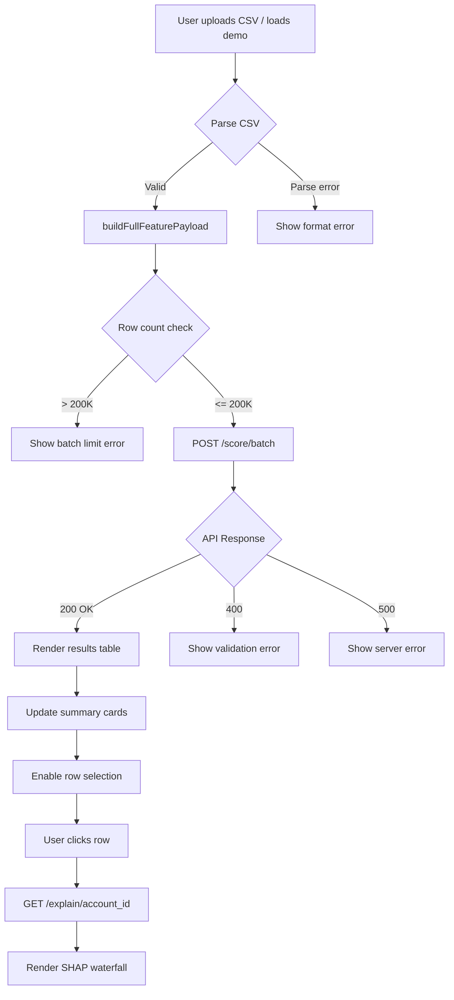
```mermaid
flowchart TD
    A[User uploads CSV / loads demo] --> B{Parse CSV}
    B -->|Valid| C[buildFullFeaturePayload]
    B -->|Parse error| E1[Show format error]
    C --> D{Row count check}
    D -->|> 200K| E2[Show batch limit error]
    D -->|<= 200K| F[POST /score/batch]
    F --> G{API Response}
    G -->|200 OK| H[Render results table]
    G -->|400| E3[Show validation error]
    G -->|500| E4[Show server error]
    H --> I[Update summary cards]
    I --> J[Enable row selection]
    J --> K[User clicks row]
    K --> L[GET /explain/account_id]
    L --> M[Render SHAP waterfall]
```
</details>
</details>

## 6.2 Single Account Scoring Flow

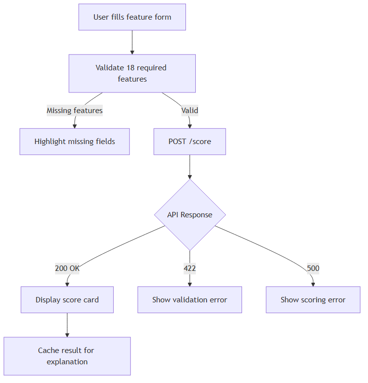

<details>
<summary>Show Mermaid Source</summary>


<details>
<summary>Show Mermaid Source</summary>

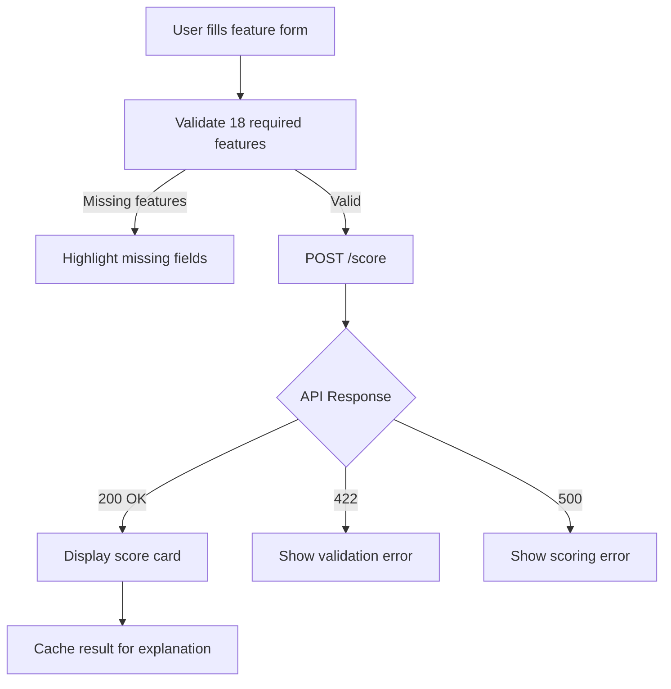
```mermaid
flowchart TD
    A[User fills feature form] --> B[Validate 18 required features]
    B -->|Missing features| E1[Highlight missing fields]
    B -->|Valid| C[POST /score]
    C --> D{API Response}
    D -->|200 OK| F[Display score card]
    D -->|422| E2[Show validation error]
    D -->|500| E3[Show scoring error]
    F --> G[Cache result for explanation]
```
</details>
</details>

## 6.3 Decision Policy Change Flow

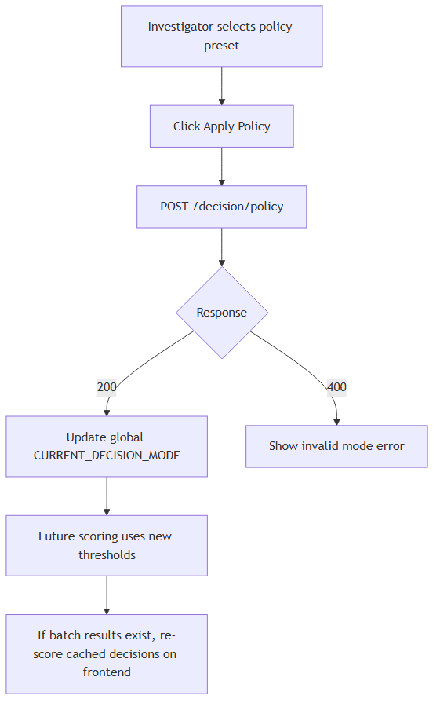

<details>
<summary>Show Mermaid Source</summary>


<details>
<summary>Show Mermaid Source</summary>

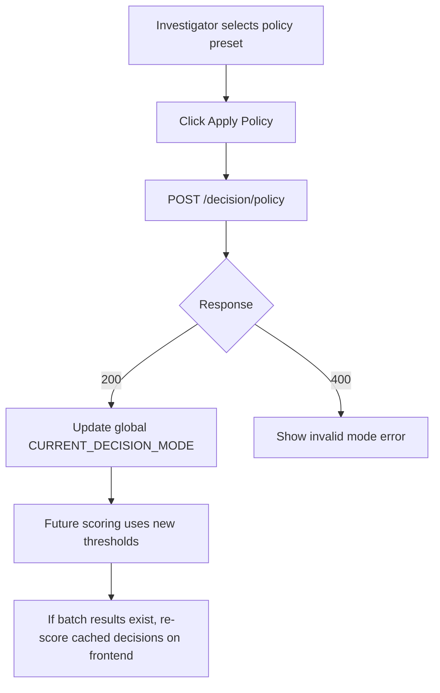
```mermaid
flowchart TD
    A[Investigator selects policy preset] --> B[Click Apply Policy]
    B --> C[POST /decision/policy]
    C --> D{Response}
    D -->|200| E[Update global CURRENT_DECISION_MODE]
    D -->|400| F[Show invalid mode error]
    E --> G[Future scoring uses new thresholds]
    G --> H[If batch results exist, re-score cached decisions on frontend]
```
</details>
</details>

## 6.4 Manual Override Flow


<details>
<summary>Show Mermaid Source</summary>


<details>
<summary>Show Mermaid Source</summary>

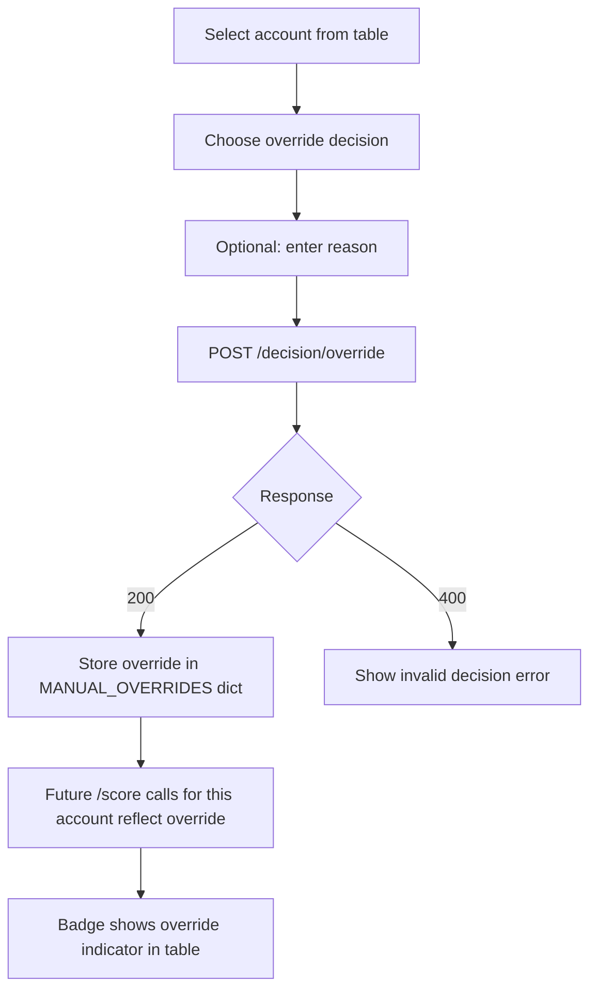
```mermaid
flowchart TD
    A[Select account from table] --> B[Choose override decision]
    B --> C[Optional: enter reason]
    C --> D[POST /decision/override]
    D --> E{Response}
    E -->|200| F[Store override in MANUAL_OVERRIDES dict]
    E -->|400| G[Show invalid decision error]
    F --> H[Future /score calls for this account reflect override]
    H --> I[Badge shows override indicator in table]
```
</details>
</details>

## 6.5 API Request Lifecycle

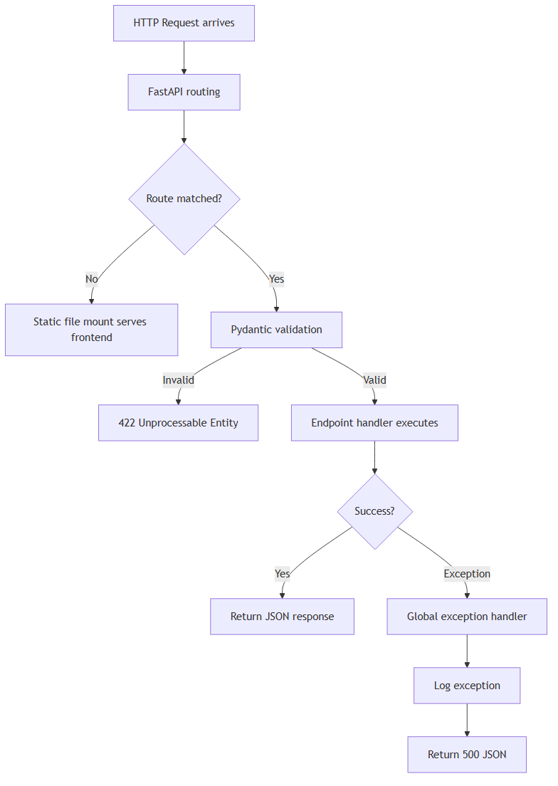

<details>
<summary>Show Mermaid Source</summary>


<details>
<summary>Show Mermaid Source</summary>

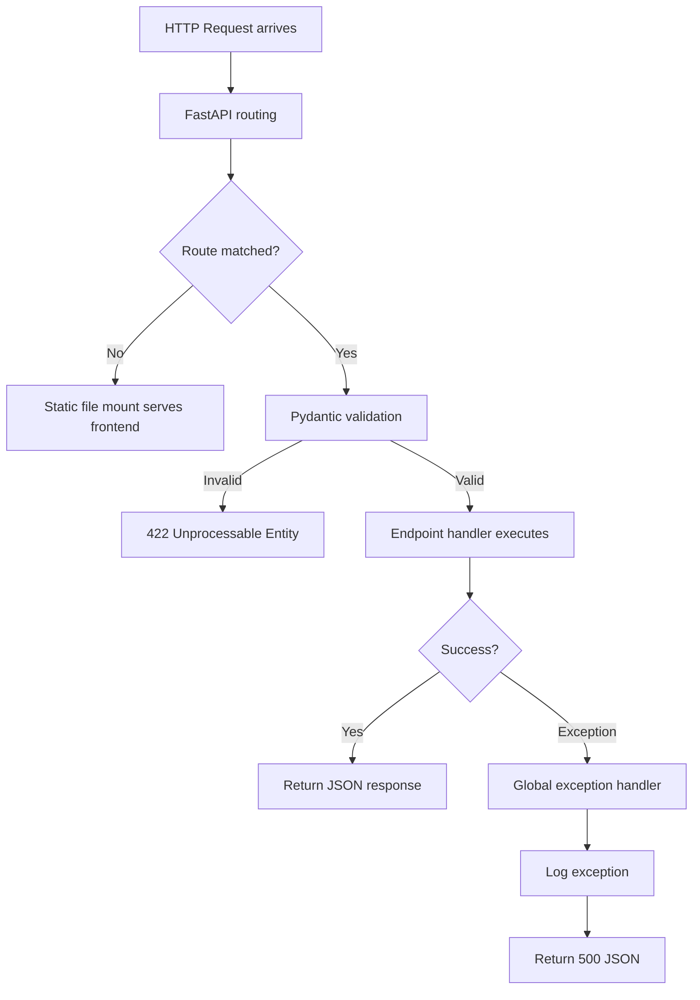
```mermaid
flowchart TD
    A[HTTP Request arrives] --> B[FastAPI routing]
    B --> C{Route matched?}
    C -->|No| D[Static file mount serves frontend]
    C -->|Yes| E[Pydantic validation]
    E -->|Invalid| F[422 Unprocessable Entity]
    E -->|Valid| G[Endpoint handler executes]
    G --> H{Success?}
    H -->|Yes| I[Return JSON response]
    H -->|Exception| J[Global exception handler]
    J --> K[Log exception]
    K --> L[Return 500 JSON]
```
</details>
</details>

## 6.6 Model Startup and Artifact Loading


<details>
<summary>Show Mermaid Source</summary>


<details>
<summary>Show Mermaid Source</summary>

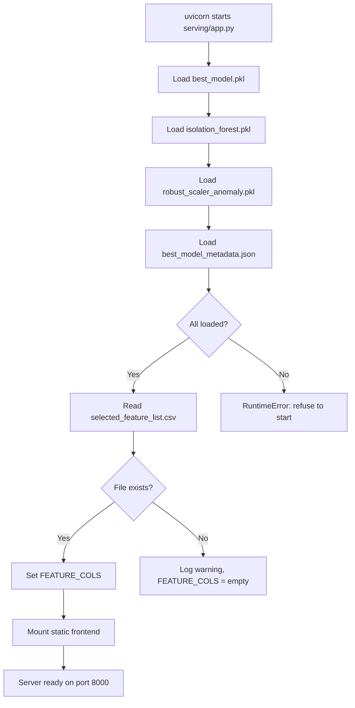
```mermaid
flowchart TD
    A[uvicorn starts serving/app.py] --> B[Load best_model.pkl]
    B --> C[Load isolation_forest.pkl]
    C --> D[Load robust_scaler_anomaly.pkl]
    D --> E[Load best_model_metadata.json]
    E --> F{All loaded?}
    F -->|Yes| G[Read selected_feature_list.csv]
    F -->|No| H[RuntimeError: refuse to start]
    G --> I{File exists?}
    I -->|Yes| J[Set FEATURE_COLS]
    I -->|No| K[Log warning, FEATURE_COLS = empty]
    J --> L[Mount static frontend]
    L --> M[Server ready on port 8000]
```
</details>
</details>

## 6.7 Sequence Diagrams

### 6.7.1 Batch CSV Upload and Scoring

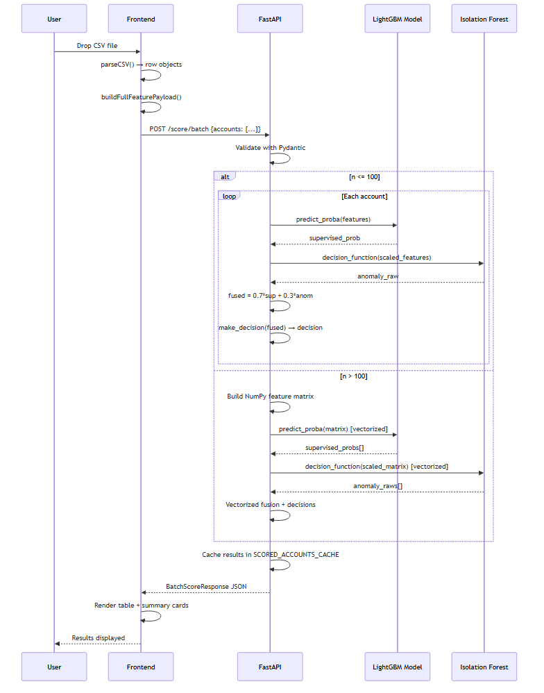

<details>
<summary>Show Mermaid Source</summary>


<details>
<summary>Show Mermaid Source</summary>

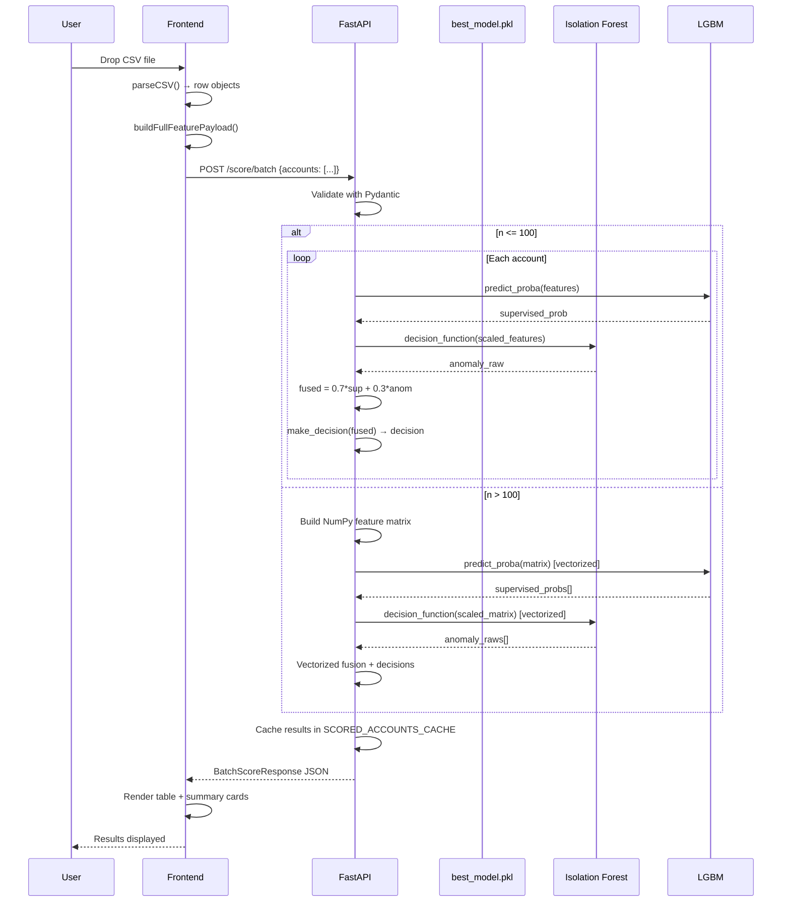
```mermaid
sequenceDiagram
    participant User
    participant Browser as Frontend
    participant API as FastAPI
    participant MODEL as best_model.pkl
    participant ISO as Isolation Forest

    User->>Browser: Drop CSV file
    Browser->>Browser: parseCSV() → row objects
    Browser->>Browser: buildFullFeaturePayload()
    Browser->>API: POST /score/batch {accounts: [...]}
    API->>API: Validate with Pydantic
    alt n <= 100
        loop Each account
            API->>LGBM: predict_proba(features)
            LGBM-->>API: supervised_prob
            API->>ISO: decision_function(scaled_features)
            ISO-->>API: anomaly_raw
            API->>API: fused = 0.7*sup + 0.3*anom
            API->>API: make_decision(fused) → decision
        end
    else n > 100
        API->>API: Build NumPy feature matrix
        API->>LGBM: predict_proba(matrix) [vectorized]
        LGBM-->>API: supervised_probs[]
        API->>ISO: decision_function(scaled_matrix) [vectorized]
        ISO-->>API: anomaly_raws[]
        API->>API: Vectorized fusion + decisions
    end
    API->>API: Cache results in SCORED_ACCOUNTS_CACHE
    API-->>Browser: BatchScoreResponse JSON
    Browser->>Browser: Render table + summary cards
    Browser-->>User: Results displayed
```
</details>
</details>

### 6.7.2 SHAP Explanation Request


<details>
<summary>Show Mermaid Source</summary>


<details>
<summary>Show Mermaid Source</summary>

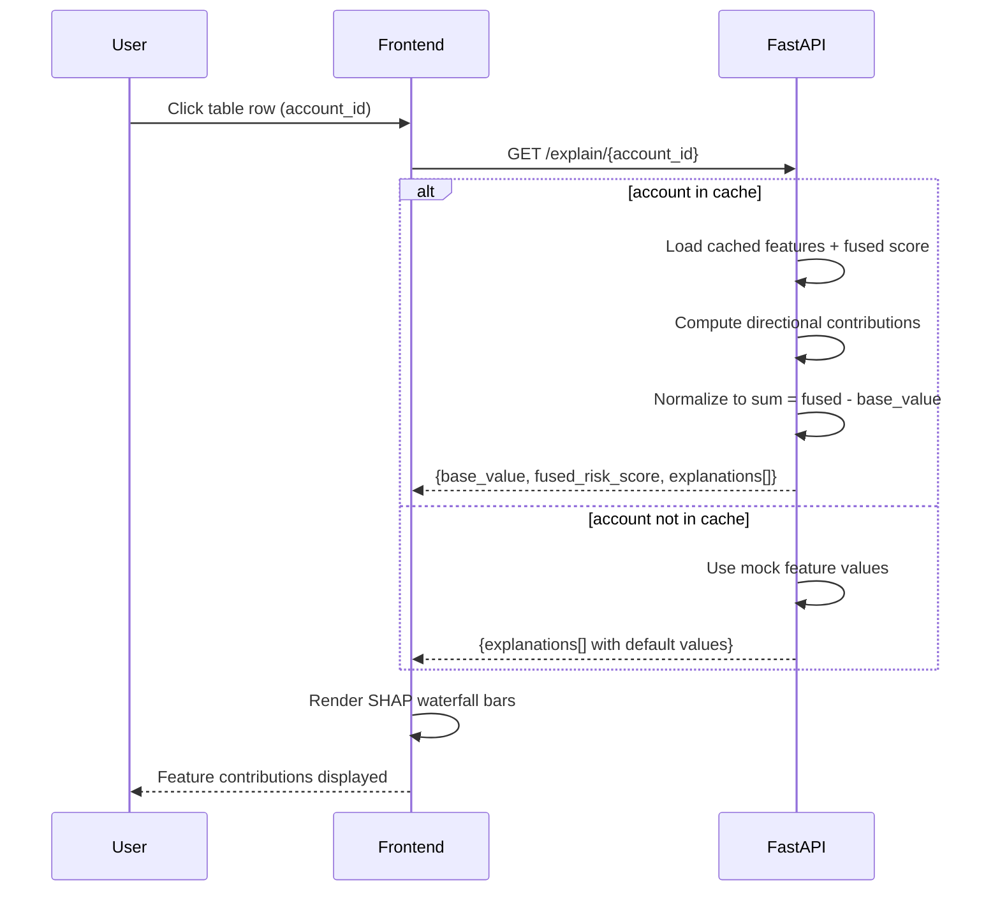
```mermaid
sequenceDiagram
    participant User
    participant Browser as Frontend
    participant API as FastAPI

    User->>Browser: Click table row (account_id)
    Browser->>API: GET /explain/{account_id}
    alt account in cache
        API->>API: Load cached features + fused score
        API->>API: Compute directional contributions
        API->>API: Normalize to sum = fused - base_value
        API-->>Browser: {base_value, fused_risk_score, explanations[]}
    else account not in cache
        API->>API: Use mock feature values
        API-->>Browser: {explanations[] with default values}
    end
    Browser->>Browser: Render SHAP waterfall bars
    Browser-->>User: Feature contributions displayed
```
</details>
</details>

### 6.7.3 Decision Override Application

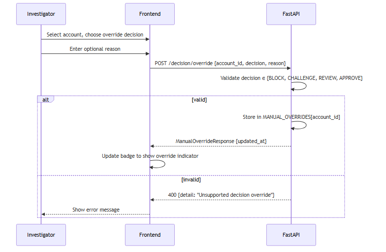

<details>
<summary>Show Mermaid Source</summary>


<details>
<summary>Show Mermaid Source</summary>

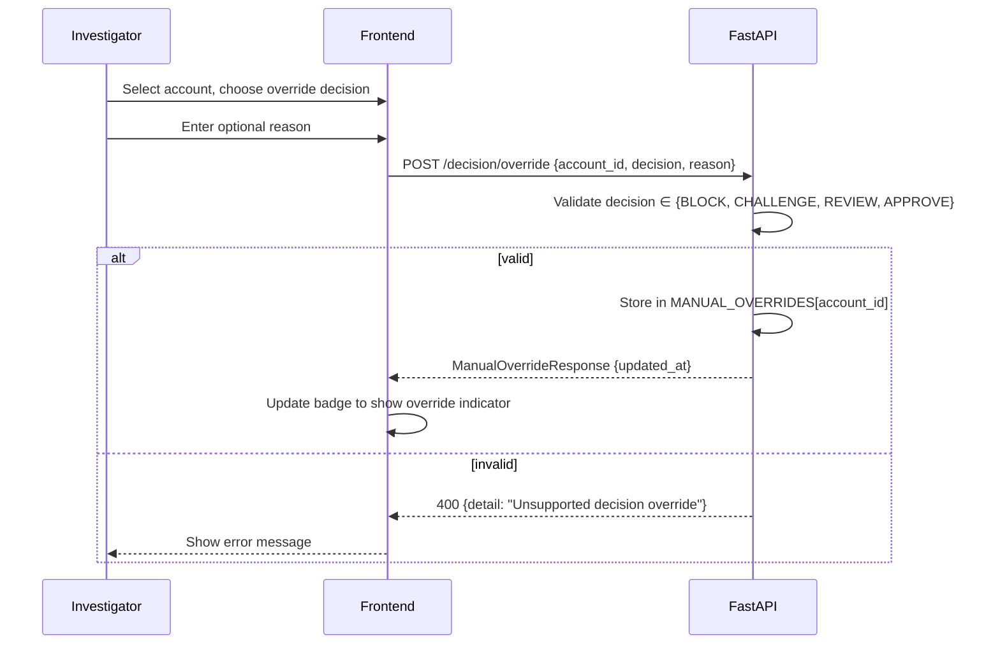
```mermaid
sequenceDiagram
    participant Investigator
    participant Browser as Frontend
    participant API as FastAPI

    Investigator->>Browser: Select account, choose override decision
    Investigator->>Browser: Enter optional reason
    Browser->>API: POST /decision/override {account_id, decision, reason}
    API->>API: Validate decision ∈ {BLOCK, CHALLENGE, REVIEW, APPROVE}
    alt valid
        API->>API: Store in MANUAL_OVERRIDES[account_id]
        API-->>Browser: ManualOverrideResponse {updated_at}
        Browser->>Browser: Update badge to show override indicator
    else invalid
        API-->>Browser: 400 {detail: "Unsupported decision override"}
        Browser-->>Investigator: Show error message
    end
```
</details>
</details>

### 6.7.4 System Health Check on Page Load

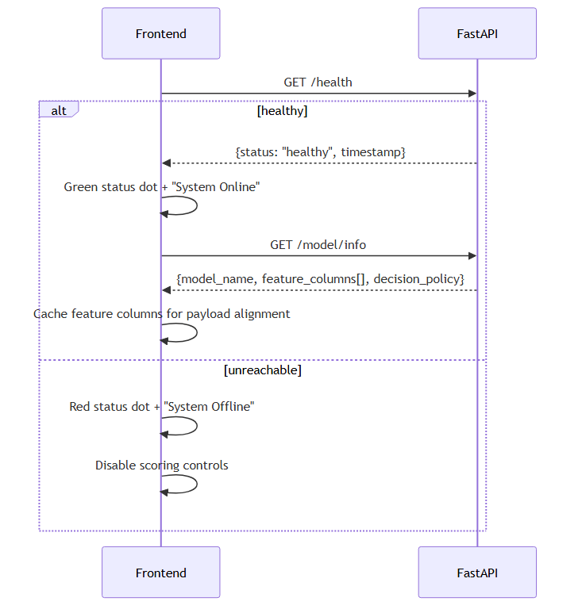

<details>
<summary>Show Mermaid Source</summary>


<details>
<summary>Show Mermaid Source</summary>

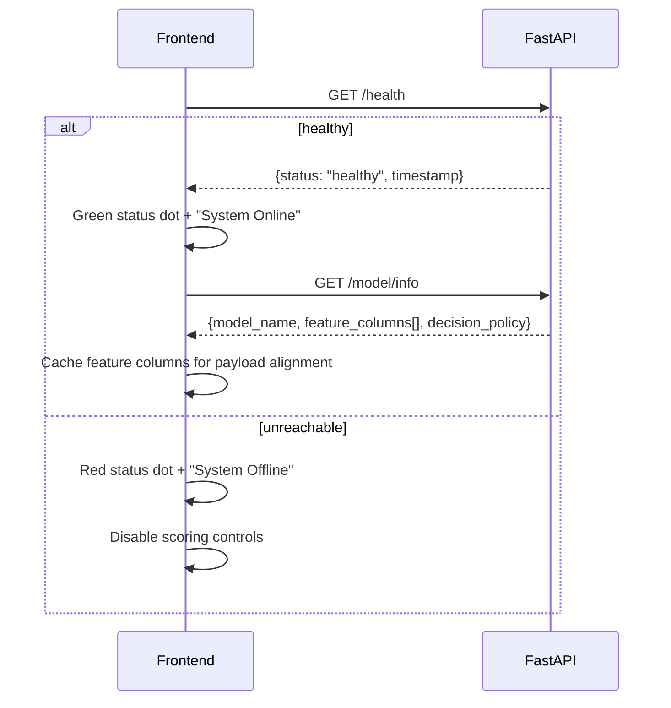
```mermaid
sequenceDiagram
    participant Browser as Frontend
    participant API as FastAPI

    Browser->>API: GET /health
    alt healthy
        API-->>Browser: {status: "healthy", timestamp}
        Browser->>Browser: Green status dot + "System Online"
        Browser->>API: GET /model/info
        API-->>Browser: {model_name, feature_columns[], decision_policy}
        Browser->>Browser: Cache feature columns for payload alignment
    else unreachable
        Browser->>Browser: Red status dot + "System Offline"
        Browser->>Browser: Disable scoring controls
    end
```
</details>
</details>

---

# 7. C4 Architecture Documentation

## 7.1 C4 System Context Diagram

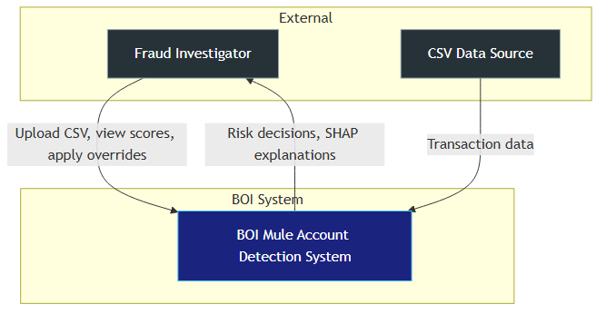

<details>
<summary>Show Mermaid Source</summary>


<details>
<summary>Show Mermaid Source</summary>

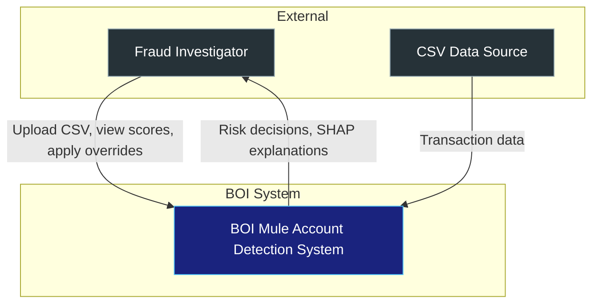
```mermaid
graph TB
    subgraph External
        INV[Fraud Investigator]
        CSV[CSV Data Source]
    end

    subgraph BOI System
        SYS[BOI Mule Account Detection System]
    end

    INV -->|Upload CSV, view scores, apply overrides| SYS
    CSV -->|Transaction data| SYS
    SYS -->|Risk decisions, SHAP explanations| INV

    style SYS fill:#1a237e,stroke:#4fc3f7,color:#fff
    style INV fill:#263238,stroke:#90a4ae,color:#fff
    style CSV fill:#263238,stroke:#90a4ae,color:#fff
```
</details>
</details>

**Trust Boundary:** `[RISK: No trust boundary exists. All endpoints are unauthenticated. The entire system is in a single trust zone.]`

## 7.2 C4 Container Diagram

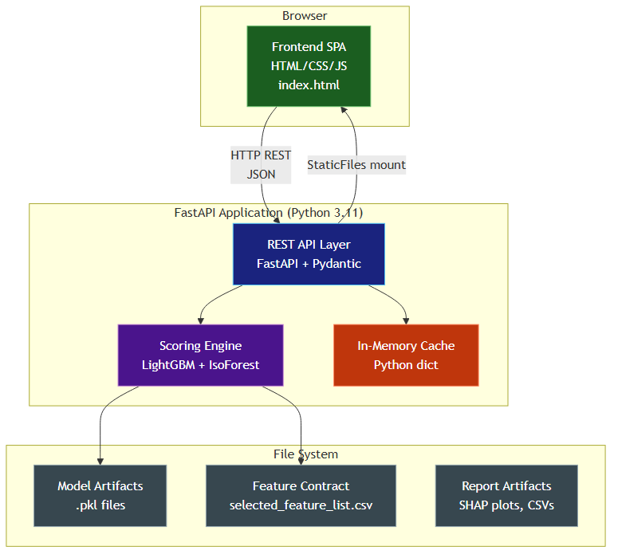

<details>
<summary>Show Mermaid Source</summary>


<details>
<summary>Show Mermaid Source</summary>

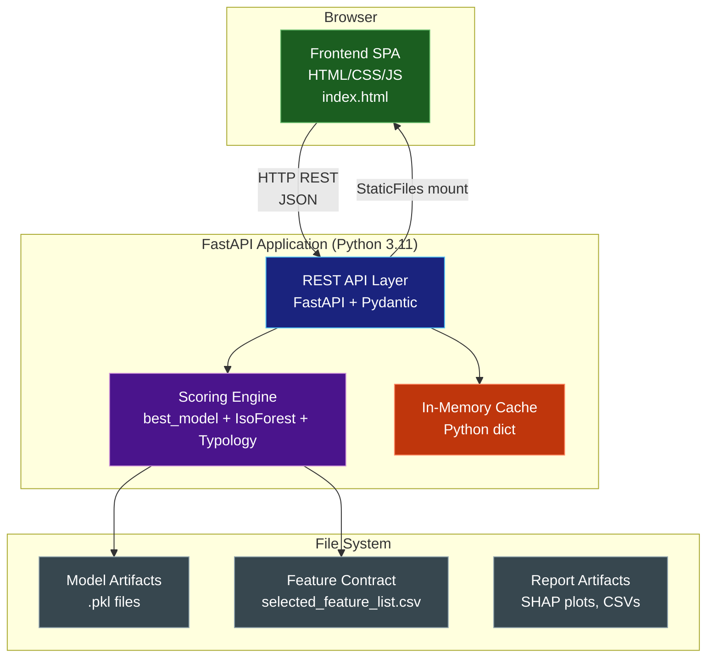
```mermaid
graph TB
    subgraph Browser
        FE[Frontend SPA<br/>HTML/CSS/JS<br/>index.html]
    end

    subgraph Server["FastAPI Application (Python 3.11)"]
        API[REST API Layer<br/>FastAPI + Pydantic]
        SCORE[Scoring Engine<br/>best_model + IsoForest + Typology]
        CACHE[In-Memory Cache<br/>Python dict]
    end

    subgraph Artifacts["File System"]
        MODELS[Model Artifacts<br/>.pkl files]
        FEATURES[Feature Contract<br/>selected_feature_list.csv]
        REPORTS[Report Artifacts<br/>SHAP plots, CSVs]
    end

    FE -->|HTTP REST<br/>JSON| API
    API --> SCORE
    SCORE --> MODELS
    SCORE --> FEATURES
    API --> CACHE
    API -->|StaticFiles mount| FE

    style FE fill:#1b5e20,stroke:#66bb6a,color:#fff
    style API fill:#1a237e,stroke:#4fc3f7,color:#fff
    style SCORE fill:#4a148c,stroke:#ce93d8,color:#fff
    style CACHE fill:#bf360c,stroke:#ff8a65,color:#fff
    style MODELS fill:#37474f,stroke:#90a4ae,color:#fff
    style FEATURES fill:#37474f,stroke:#90a4ae,color:#fff
    style REPORTS fill:#37474f,stroke:#90a4ae,color:#fff
```
</details>
</details>

## 7.3 C4 Component Diagram

| Component | Responsibility | Interfaces | Dependencies | Notes |
|:--|:--|:--|:--|:--|
| `TransactionFeatures` (Pydantic) | Validate input with 18 required bank features | JSON → Python dict | pydantic | `[OBSERVED: @validator enforces all 18 bank-specified features]` |
| `ScoreResponse` (Pydantic) | Structure scoring output including suspicion, typology, override metadata | Python dict → JSON | pydantic | `[OBSERVED: Includes suspicion_level, suspicion_label, typology_flags, adjusted_fused_risk_score]` |
| `build_feature_vector()` | Align incoming features to training column order | dict → pd.DataFrame | pandas, FEATURE_COLS | `[OBSERVED: Missing features filled with 0.0]` |
| `score_single()` | Core scoring: supervised → anomaly → fusion → typology → suspicion → decision | TransactionFeatures → ScoreResponse | best_model, iso_forest, typology_engine | `[OBSERVED: Also checks MANUAL_OVERRIDES]` |
| `make_decision()` | Map fused score to 4-tier decision | float → (str, str) | DECISION_PRESETS, CURRENT_DECISION_MODE | `[OBSERVED: Uses current_thresholds() for active policy]` |
| `explain()` | Generate SHAP TreeExplainer feature contributions | account_id → explanation dict | SCORED_ACCOUNTS_CACHE, best_model | `[OBSERVED: Real TreeExplainer on production model]` |
| `score_batch()` | Vectorized batch scoring for large payloads | List[TransactionFeatures] → BatchScoreResponse | numpy, best_model, iso_forest | `[OBSERVED: Split at 100 rows: loop vs vectorized]` |
| `normalize_decision_mode()` | Alias mapping for policy names | str → str | None | `[OBSERVED: Supports "stricter"→"strict", "looser"→"loose", "default"→"balanced"]` |

## 7.4 Deployment Diagram

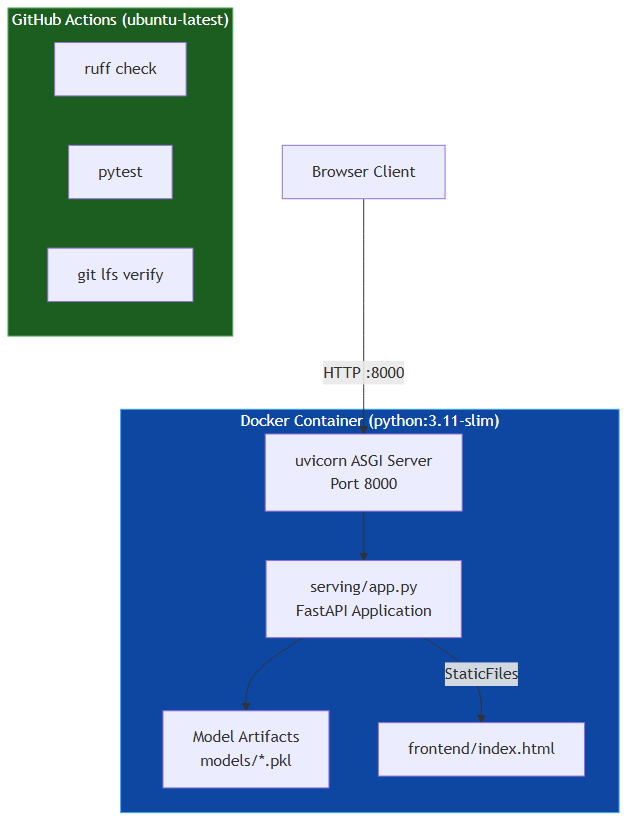

<details>
<summary>Show Mermaid Source</summary>


<details>
<summary>Show Mermaid Source</summary>

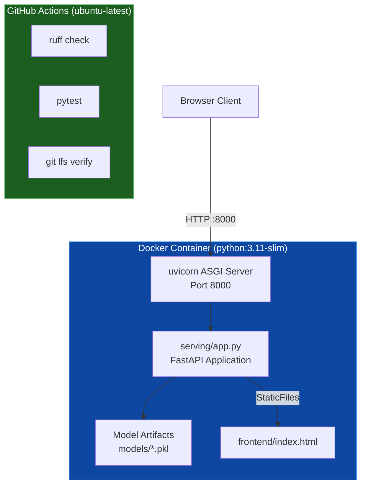
```mermaid
graph TB
    subgraph Docker["Docker Container (python:3.11-slim)"]
        UV[uvicorn ASGI Server<br/>Port 8000]
        APP[serving/app.py<br/>FastAPI Application]
        PKL[Model Artifacts<br/>models/*.pkl]
        HTML[frontend/index.html]
    end

    subgraph CI["GitHub Actions (ubuntu-latest)"]
        LINT[ruff check]
        TEST[pytest]
        LFS[git lfs verify]
    end

    CLIENT[Browser Client] -->|HTTP :8000| UV
    UV --> APP
    APP --> PKL
    APP -->|StaticFiles| HTML

    style Docker fill:#0d47a1,stroke:#42a5f5,color:#fff
    style CI fill:#1b5e20,stroke:#66bb6a,color:#fff
```
</details>
</details>

`[MISSING: No staging, production, or multi-environment deployment. No Kubernetes manifests. No secrets management. No monitoring agents.]`

## 7.5 Technology Stack Rationale

| Layer | Current Technology | Version | Rationale | Alternatives Considered | Trade-offs |
|:--|:--|:--|:--|:--|:--|
| Backend Framework | FastAPI | ≥ 0.104.0 | `[OBSERVED: Async-capable, auto-generates OpenAPI docs, Pydantic validation]` | Flask, Django REST | FastAPI is fastest for ML serving; built-in validation |
| ASGI Server | uvicorn | ≥ 0.24.0 | `[OBSERVED: Standard ASGI server for FastAPI]` | gunicorn+uvicorn workers | Single-worker default; production needs multi-worker |
| ML Primary | XGBoost (production) + model zoo | lightgbm, xgboost, catboost | `[OBSERVED: best_model.pkl auto-selected by holdout PR-AUC]` | Single-model deployment | Zoo improves robustness; XGBoost current winner |
| ML Secondary | XGBoost | implicit | `[OBSERVED: Complementary learner for stacking ensemble]` | CatBoost | XGBoost provides diversity in stacking |
| ML Framework | scikit-learn | ≥ 1.3.0 | `[OBSERVED: RandomForest, LogisticRegression, IsolationForest, preprocessing]` | None — standard | Industry standard for classical ML |
| Anomaly Detection | IsolationForest (sklearn) | via scikit-learn | `[OBSERVED: Semi-supervised, trained on legitimate accounts only]` | ECOD (pyod), Autoencoder (torch) | `[OBSERVED: ECOD and Autoencoder are optional — skipped if deps missing]` |
| Explainability | SHAP | ≥ 0.44.0 | `[OBSERVED: Offline SHAP via TreeExplainer in Phase 4 notebook]` | LIME | SHAP satisfies fairness axioms; TreeExplainer is fast for trees |
| HPO | Optuna | optional | `[OBSERVED: Bayesian optimisation for LightGBM hyperparameters]` | GridSearch, RandomSearch | Optuna more sample-efficient; gracefully skipped if not installed |
| Data Processing | pandas + numpy | ≥ 2.0 / ≥ 1.24 | `[OBSERVED: Feature engineering, data loading, alignment]` | Polars | pandas is standard; good enough for ~100K rows |
| Data Format | Parquet (with CSV fallback) | via pyarrow | `[OBSERVED: Engineered data saved as .parquet; CSV fallback if pyarrow unavailable]` | Feather, HDF5 | Parquet is columnar, compressed, fast |
| Frontend | Vanilla HTML/CSS/JS | N/A | `[OBSERVED: Single-page app with glassmorphism design, no framework]` | React, Vue | Zero build step; self-contained; suitable for hackathon |
| Frontend Fonts | Google Fonts (Inter, Outfit) | CDN | `[OBSERVED: Modern typography via CDN]` | System fonts | Premium feel for hackathon demo |
| Container | Docker | python:3.11-slim | `[OBSERVED: Reproducible deployment]` | Podman | Docker is standard |
| CI/CD | GitHub Actions | N/A | `[OBSERVED: ci.yml with lint + test + LFS verify]` | GitLab CI, Jenkins | GitHub-native; zero setup |
| Linting | ruff | via pip | `[OBSERVED: Modern Python linter, fast]` | flake8, pylint | ruff is significantly faster |
| Serialization | joblib | ≥ 1.3.0 | `[OBSERVED: .pkl files for models and scalers]` | pickle, ONNX | joblib handles large numpy arrays efficiently |
| Validation | Pydantic | ≥ 2.4.0 | `[OBSERVED: Input validation via BaseModel + @validator]` | marshmallow, cerberus | Native FastAPI integration |
| Version Control | Git + Git-LFS | N/A | `[OBSERVED: LFS tracks the 111 MB DataSet.csv]` | DVC | LFS is simpler for a single large file |

## 7.6 Architecture Decision Records

### ADR-001: Model Zoo with Auto-Selected Production Model

- **Context:** `[OBSERVED: 3,923 raw features, binary classification, extreme class imbalance]`
- **Decision:** `[OBSERVED: Train 8 candidates + stacking; deploy holdout PR-AUC winner as best_model.pkl (currently XGBoost)]`
- **Alternatives Considered:** Hard-coded LightGBM only, stacking-only deployment
- **Consequences:** Holdout PR-AUC 0.888; precision 0.778 @ recall 0.875; recall @ FPR 1% = 1.0
- **Risks:** Small holdout positives (16); mitigated by stratified split and leakage audit
- **Rollback:** Fallback to lgbm_final.pkl if best_model.pkl missing

### ADR-002: Fused Risk Score (70/30 Blend)

- **Context:** `[OBSERVED: Need to catch both known fraud patterns and novel mule typologies]`
- **Decision:** `[OBSERVED: 70% supervised + 30% anomaly score fusion]`
- **Alternatives Considered:** 100% supervised, 50/50 blend, learned weights
- **Consequences:** Novel fraud patterns get a 30% contribution even without labeled data
- **Risks:** Fixed weights may not be optimal; `[INFERRED STRATEGY: Tune weights on held-out set using Bayesian optimization]`
- **Rollback:** Change W_SUPER/W_ANOMAL constants in scoring code

### ADR-004: Typology Engine + Suspicion Levels

- **Context:** Supervised models miss orthogonal behavioural signals (silent accounts, large movers).
- **Decision:** `[OBSERVED: Rule-based TypologyEngine on 18 bank keys + capped score boost; map adjusted score to suspicion_level 1–4]`
- **Consequences:** Investigators receive typology_flags alongside decision; `/alerts/suspicious-list` enables watch-list filtering.
- **Rollback:** Disable typology boost (set boost to 0) without retraining models.

### ADR-003: In-Memory State (No Database)

- **Context:** `[OBSERVED: Hackathon scope — minimize infrastructure dependencies]`
- **Decision:** `[OBSERVED: SCORED_ACCOUNTS_CACHE and MANUAL_OVERRIDES stored as Python dicts]`
- **Alternatives Considered:** PostgreSQL, Redis, SQLite
- **Consequences:** Zero infrastructure cost; data lost on restart; no audit trail
- **Risks:** `[RISK: Production deployment requires persistent storage. Override decisions are not recoverable]`
- **Rollback:** Add Redis for cache + PostgreSQL for audit trail

### ADR-004: Single FastAPI Process Serving Both API and Frontend

- **Context:** `[OBSERVED: Need a self-contained demo — backend and frontend in one process]`
- **Decision:** `[OBSERVED: Frontend mounted as StaticFiles at root after all API routes]`
- **Alternatives Considered:** Separate nginx for frontend; separate frontend server
- **Consequences:** Simple deployment; potential route conflicts; no CDN for static assets
- **Risks:** Static file mount at "/" can shadow API routes if not mounted last
- **Rollback:** Deploy frontend separately via nginx or S3 + CloudFront

### ADR-005: Isolation Forest Trained Only on Legitimate Accounts

- **Context:** `[OBSERVED: Semi-supervised approach — model learns "normal" behavior]`
- **Decision:** `[OBSERVED: iso_forest.fit(X[y == 0]) — trained exclusively on class 0]`
- **Alternatives Considered:** Train on all data; train on balanced sample
- **Consequences:** Mule accounts appear as outliers relative to learned normalcy
- **Risks:** If class labels are noisy (some mules labeled as legitimate), the model learns corrupted normalcy
- **Rollback:** Retrain on filtered subset after label quality audit

## 7.7 Failure Mode and Resilience Notes

| Component | Single Point of Failure | Degraded Mode | Retry Strategy | Circuit Breaker | Timeout | Backup / Restore | Chaos Test |
|:--|:--|:--|:--|:--|:--|:--|:--|
| FastAPI Process | `[RISK: Yes — single process]` | `[MISSING]` | `[MISSING]` | `[MISSING]` | `[MISSING]` | `[MISSING: No backup. Restart process]` | `[MISSING]` |
| Model Artifacts (.pkl) | `[RISK: Yes — app refuses to start without them]` | N/A | N/A | N/A | N/A | `[OBSERVED: Re-run training notebooks]` | `[MISSING]` |
| Feature List CSV | `[OBSERVED: Soft failure — warning logged, FEATURE_COLS = []]` | Scoring uses sorted feature keys | N/A | N/A | N/A | Re-run feature engineering | `[MISSING]` |
| In-Memory Cache | `[RISK: Lost on restart. Capped at 1K entries]` | /explain returns mock values | N/A | N/A | N/A | `[MISSING]` | `[MISSING]` |
| Git-LFS DataSet.csv | `[OBSERVED: Not needed at serving time]` | No impact on API | N/A | N/A | N/A | `git lfs pull` | N/A |

## 7.8 Disaster Recovery

| Item | Current State |
|:--|:--|
| RPO | `[MISSING: No database, so no data to lose except in-memory overrides]` |
| RTO | `[INFERRED: ~30 seconds to restart Docker container and reload model artifacts]` |
| Failover Strategy | `[MISSING: Single instance, no failover]` |
| Restore Testing Frequency | `[MISSING]` |
| Backup Retention Rules | `[OBSERVED: Model artifacts are in Git. DataSet.csv is in Git-LFS. No other backups]` |

---

# 8. Data Model and Data Lineage Documentation

## 8.1 Core Entity Specification

`[OBSERVED: This system does not use a traditional database. All data is file-based and in-memory.]`

| Entity | Field | Type | Nullable | Default | Indexed | Constraint | Description |
|:--|:--|:--|:--|:--|:--|:--|:--|
| Raw Dataset (DataSet.csv) | F1 – F3923 | float64 | Yes | N/A | N/A | N/A | 3,923 anonymized features |
| Raw Dataset | F3924 | int (0/1) | No | N/A | N/A | Binary | Target: 1 = Mule, 0 = Legitimate |
| Engineered Dataset | selected features + FEAT_* + LOG_* | float32 | No (imputed) | Median/0.0 | N/A | N/A | ~200+ features after engineering |
| SCORED_ACCOUNTS_CACHE | account_id (key) | str | No | N/A | Dict key | Unique | Account identifier |
| SCORED_ACCOUNTS_CACHE | features | dict | No | N/A | N/A | N/A | Feature values at scoring time |
| SCORED_ACCOUNTS_CACHE | supervised_prob | float | No | N/A | N/A | [0, 1] | Production model prediction |
| SCORED_ACCOUNTS_CACHE | anomaly_score | float | No | N/A | N/A | [0, 1] | Isolation Forest score |
| SCORED_ACCOUNTS_CACHE | fused | float | No | N/A | N/A | [0, 1] | 70/30 weighted blend |
| SCORED_ACCOUNTS_CACHE | decision | str | No | N/A | N/A | BLOCK/CHALLENGE/REVIEW/APPROVE | Active decision |
| MANUAL_OVERRIDES | account_id (key) | str | No | N/A | Dict key | Unique | Account to override |
| MANUAL_OVERRIDES | decision | str | No | N/A | N/A | BLOCK/CHALLENGE/REVIEW/APPROVE | Override decision |
| MANUAL_OVERRIDES | reason | str | Yes | None | N/A | N/A | Investigator notes |
| MANUAL_OVERRIDES | updated_at | str (ISO) | No | utcnow | N/A | N/A | Override timestamp |
| best_model_metadata.json | best_model | str | No | N/A | N/A | N/A | "XGBoost" |
| best_model_metadata.json | optimal_threshold | float | No | N/A | N/A | [0, 1] | F1-optimal threshold |
| best_model_metadata.json | best_roc_auc | float | No | N/A | N/A | [0, 1] | ROC-AUC on OOF predictions |
| best_model_metadata.json | best_pr_auc | float | No | N/A | N/A | [0, 1] | PR-AUC on OOF predictions |
| best_model_metadata.json | optimal_f1 | float | No | N/A | N/A | [0, 1] | F1 at optimal threshold |

## 8.2 ER Diagram

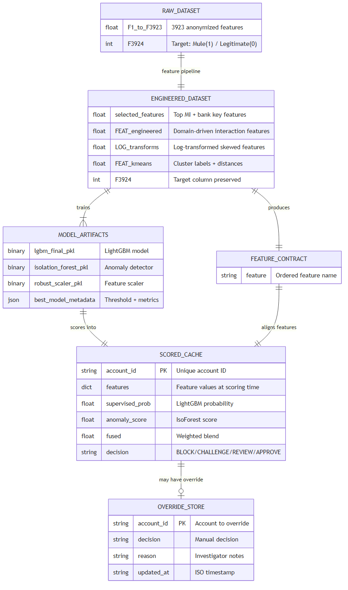

<details>
<summary>Show Mermaid Source</summary>


<details>
<summary>Show Mermaid Source</summary>

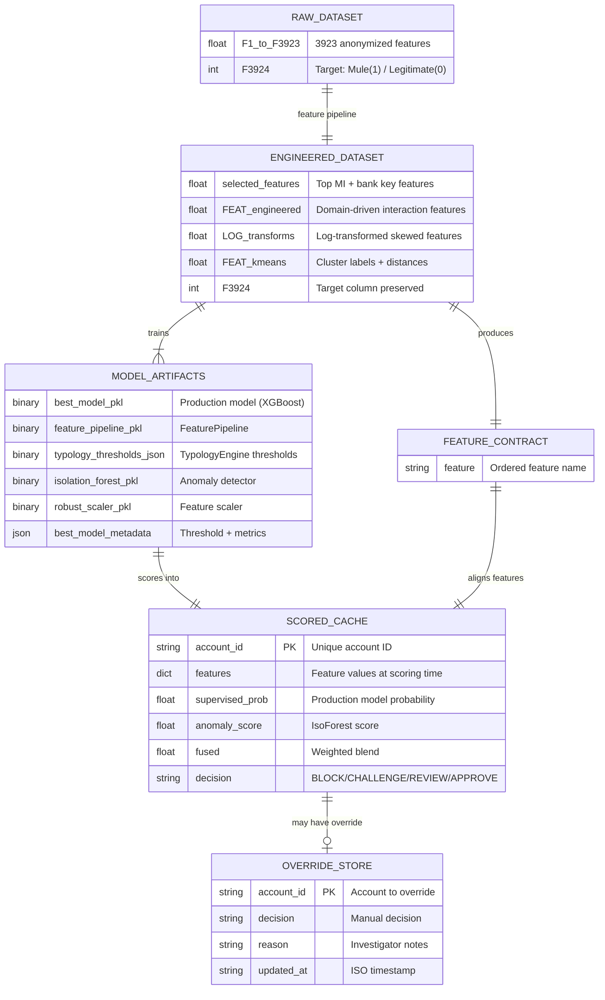
```mermaid
erDiagram
    RAW_DATASET {
        float F1_to_F3923 "3923 anonymized features"
        int F3924 "Target: Mule(1) / Legitimate(0)"
    }
    ENGINEERED_DATASET {
        float selected_features "Top MI + bank key features"
        float FEAT_engineered "Domain-driven interaction features"
        float LOG_transforms "Log-transformed skewed features"
        float FEAT_kmeans "Cluster labels + distances"
        int F3924 "Target column preserved"
    }
    MODEL_ARTIFACTS {
        binary best_model_pkl "Production model (XGBoost)"
        binary feature_pipeline_pkl "FeaturePipeline"
        binary typology_thresholds_json "TypologyEngine thresholds"
        binary isolation_forest_pkl "Anomaly detector"
        binary robust_scaler_pkl "Feature scaler"
        json best_model_metadata "Threshold + metrics"
    }
    FEATURE_CONTRACT {
        string feature "Ordered feature name"
    }
    SCORED_CACHE {
        string account_id PK "Unique account ID"
        dict features "Feature values at scoring time"
        float supervised_prob "Production model probability"
        float anomaly_score "IsoForest score"
        float fused "Weighted blend"
        string decision "BLOCK/CHALLENGE/REVIEW/APPROVE"
    }
    OVERRIDE_STORE {
        string account_id PK "Account to override"
        string decision "Manual decision"
        string reason "Investigator notes"
        string updated_at "ISO timestamp"
    }

    RAW_DATASET ||--|| ENGINEERED_DATASET : "feature pipeline"
    ENGINEERED_DATASET ||--|{ MODEL_ARTIFACTS : "trains"
    ENGINEERED_DATASET ||--|| FEATURE_CONTRACT : "produces"
    MODEL_ARTIFACTS ||--|| SCORED_CACHE : "scores into"
    FEATURE_CONTRACT ||--|| SCORED_CACHE : "aligns features"
    SCORED_CACHE ||--o| OVERRIDE_STORE : "may have override"
```
</details>
</details>

## 8.3 Data Lineage Mapping

| Data Element | Source | Transformation | Destination | Owner | Quality Score |
|:--|:--|:--|:--|:--|:--|
| Raw features (F1–F3923) | DataSet.csv | None | 00_eda_exploration.py | Data Science | `[OBSERVED: Some features >50% missing]` |
| Imputed features | 00_eda → 01_feature_engineering | Drop >50% missing → median impute → variance filter → MI rank | data/engineered/*.parquet | Data Science | `[OBSERVED: No NaN after imputation]` |
| Interaction features | 01_feature_engineering | Domain formulas (ratios, logs, products) | data/engineered/*.parquet | Data Science | Derived — depends on input quality |
| Cluster features | 01_feature_engineering | KMeans(k=5) on top-20 MI features | data/engineered/*.parquet | Data Science | Synthetic — stable |
| Feature contract | 01_feature_engineering | Column list export | reports/features/selected_feature_list.csv | Data Science | `[OBSERVED: Authoritative for serving alignment]` |
| Trained models | 02_model_training | Stratified 5-fold CV + holdout eval | models/*.pkl | Data Science | `[OBSERVED: Holdout PR-AUC=0.888]` |
| Anomaly model | 03_anomaly_detection | IsoForest trained on y=0 only | models/isolation_forest.pkl | Data Science | `[OBSERVED: Semi-supervised]` |
| Risk scores | 03_anomaly_detection | 70/30 fusion | reports/models/risk_scores_all_accounts.csv | Data Science | Derived |
| SHAP explanations | 04_shap_explainability | TreeExplainer on sampled data | reports/explainability/*.csv, *.png | Data Science | `[OBSERVED: Offline only]` |
| Scoring results | serving/app.py | Real-time inference | In-memory cache (SCORED_ACCOUNTS_CACHE) | Engineering | Ephemeral — lost on restart |
| Override decisions | serving/app.py | Investigator manual input | In-memory dict (MANUAL_OVERRIDES) | Investigator | `[RISK: Ephemeral — lost on restart]` |

---

# 9. Dependency and Library Documentation

## 9.1 Dependency Inventory

| Package / Library | Version | Ecosystem | Layer | Purpose | Direct / Transitive | Criticality | Security / License Notes |
|:--|:--|:--|:--|:--|:--|:--|:--|
| numpy | ≥ 1.24.0 | PyPI | Core | Array operations, feature matrix | Direct | Critical | BSD |
| pandas | ≥ 2.0.0 | PyPI | Core | DataFrame operations, CSV/Parquet I/O | Direct | Critical | BSD |
| scipy | ≥ 1.11.0 | PyPI | Core | Statistical functions (EDA) | Direct | Medium | BSD |
| scikit-learn | ≥ 1.3.0 | PyPI | ML | IsolationForest, RandomForest, LR, preprocessing, metrics | Direct | Critical | BSD |
| lightgbm | ≥ 4.0.0 | PyPI | ML | Primary supervised model | Direct | Critical | MIT |
| joblib | ≥ 1.3.0 | PyPI | Core | Model serialization (.pkl) | Direct | Critical | BSD |
| fastapi | ≥ 0.104.0 | PyPI | Backend | REST API framework | Direct | Critical | MIT |
| uvicorn[standard] | ≥ 0.24.0 | PyPI | Backend | ASGI server | Direct | Critical | BSD |
| pydantic | ≥ 2.4.0 | PyPI | Backend | Input validation | Direct (via FastAPI) | Critical | MIT |
| shap | ≥ 0.44.0 | PyPI | ML/Explain | SHAP TreeExplainer (offline) | Direct | Medium | MIT |
| xgboost | implicit | PyPI | ML | Complementary classifier | Direct (in notebooks) | High | Apache 2.0 |
| matplotlib | implicit | PyPI | Visualization | EDA and model report plots | Direct (in notebooks) | Low (not needed at serving) | PSF |
| seaborn | implicit | PyPI | Visualization | Heatmaps, confusion matrix | Direct (in notebooks) | Low | BSD |

## 9.2 Optional Dependencies (Commented Out in requirements.txt)

| Package | Purpose | Status |
|:--|:--|:--|
| torch | Autoencoder anomaly detection | `[OBSERVED: Code exists in 03_anomaly_detection.py; gracefully skipped if not installed]` |
| pyod | ECOD anomaly detection | `[OBSERVED: Code exists in 03_anomaly_detection.py; gracefully skipped]` |
| optuna | LightGBM hyperparameter optimization | `[OBSERVED: Gracefully falls back to DEFAULT_LGBM_PARAMS]` |
| pytest | Test runner | `[OBSERVED: Referenced in ci.yml; installed at CI time]` |
| ruff | Linter | `[OBSERVED: Referenced in ci.yml; installed at CI time]` |

## 9.3 Dependency Risk Analysis

| Risk Type | Finding | Severity | Mitigation |
|:--|:--|:--|:--|
| No lockfile | `[OBSERVED: requirements.txt uses >= ranges. No pip freeze or requirements.lock]` | 🟡 Medium | Generate lockfile with `pip-compile` |
| Unused at serving time | `[OBSERVED: shap is in requirements.txt but /explain endpoint does NOT use SHAP library]` | 🟢 Low | Move shap to optional/dev dependencies |
| Missing at serving time | `[OBSERVED: xgboost, matplotlib, seaborn are used in notebooks but NOT in requirements.txt active deps]` | 🟡 Medium | Split into requirements-serve.txt and requirements-train.txt |
| Duplicate FastAPI instantiation | `[OBSERVED: app = FastAPI() on line 37 AND line 195 of serving/app.py]` | 🟡 Medium | Remove the first instantiation on line 37 |
| `[DEPRECATED]` validator decorator | `[OBSERVED: @validator used in Pydantic v2 — deprecated in favor of @field_validator]` | 🟢 Low | Migrate to @field_validator for Pydantic v3 compatibility |

## 9.4 Setup and Build Instructions

```bash
# Prerequisites: Python 3.11+, Git with LFS support

# 1. Clone and setup
git clone https://github.com/Blackbebertex/BOI-Project.git
cd BOI-Project
git lfs install && git lfs pull

# 2. Virtual environment
python -m venv .venv
.venv\Scripts\activate          # Windows
# source .venv/bin/activate     # Linux/macOS

# 3. Install dependencies
pip install -r requirements.txt

# 4. Run training pipeline (sequential)
python notebooks/00_eda_exploration.py
python notebooks/01_feature_engineering.py
python notebooks/02_model_training.py
python notebooks/03_anomaly_detection.py
python notebooks/04_shap_explainability.py

# 5. Start API server
uvicorn serving.app:app --host 0.0.0.0 --port 8000

# 6. Docker build (alternative)
docker build -t boi-mule-detector .
docker run -p 8000:8000 boi-mule-detector
```

---

# 10. Security and Zero Trust Documentation

## 10.1 Authentication Design

| Method | Implementation | Token / Session Lifecycle | Session Storage | Notes |
|:--|:--|:--|:--|:--|
| None | `[OBSERVED: No authentication on any endpoint]` | N/A | N/A | `[RISK: CRITICAL — all endpoints are publicly accessible]` |

`[INFERRED STRATEGY BASED ON MARKET STANDARD: Implement OAuth2 / JWT bearer authentication. Minimum viable: API key header for machine-to-machine scoring, JWT for investigator UI sessions.]`

## 10.2 Authorization Matrix

`[MISSING: No roles or permissions exist in the codebase. All users have full access to all endpoints.]`

`[INFERRED STRATEGY BASED ON MARKET STANDARD:]`

| Role | /score | /score/batch | /explain | /decision/policy | /decision/override | /model/info | /health |
|:--|:--|:--|:--|:--|:--|:--|:--|
| Scoring Service | ✅ | ✅ | ❌ | ❌ | ❌ | ✅ | ✅ |
| Investigator | ✅ | ✅ | ✅ | ❌ | ✅ | ✅ | ✅ |
| Supervisor | ✅ | ✅ | ✅ | ✅ | ✅ | ✅ | ✅ |
| Admin | ✅ | ✅ | ✅ | ✅ | ✅ | ✅ | ✅ |

## 10.3 Security Controls

| Control | Implementation | Verification Method |
|:--|:--|:--|
| Password hashing | `[MISSING: No user management]` | N/A |
| Token security | `[MISSING: No tokens]` | N/A |
| Secret management | `[MISSING: No secrets to manage — no DB credentials, no API keys]` | N/A |
| CSRF protection | `[MISSING: No CSRF tokens — API only, no server-rendered forms]` | N/A |
| XSS prevention | `[OBSERVED: Frontend uses template literals for DOM injection — potential XSS if account_id contains HTML]` | `[RISK: Sanitize account_id before DOM insertion]` |
| CORS policy | `[OBSERVED: allow_origins=["*"] — allows any origin]` | `[RISK: Restrict to known frontend domains]` |
| Rate limiting | `[MISSING]` | `[INFERRED STRATEGY: Add slowapi middleware]` |
| Input validation | `[OBSERVED: Pydantic validation on all POST endpoints. 18 required features enforced]` | ✅ Automated via FastAPI |
| Audit logging | `[OBSERVED: logger.info for scoring events. No structured audit trail]` | `[RISK: Non-compliant for regulated banking]` |
| Intrusion detection | `[MISSING]` | `[INFERRED STRATEGY: WAF + anomaly detection on API traffic]` |

## 10.4 Data Protection

| State | Protection Method | Key Management |
|:--|:--|:--|
| In transit | `[MISSING: No TLS configured — uvicorn serves plain HTTP]` | `[INFERRED STRATEGY: Deploy behind nginx/ALB with TLS termination]` |
| At rest | `[MISSING: Model artifacts are unencrypted .pkl files on disk]` | `[INFERRED STRATEGY: Encrypt at filesystem level or use vault]` |
| PII masking | `[OBSERVED: Features are anonymized (F1–F3923). Account IDs are user-supplied strings]` | `[INFERRED: Account IDs may contain PII]` |

## 10.5 Threat Model Summary

| Threat | Attack Surface | Likelihood | Impact | Mitigation |
|:--|:--|:--|:--|:--|
| Unauthorized scoring access | All API endpoints (no auth) | High | Critical | Implement authentication |
| Model poisoning via override | POST /decision/override | Medium | High | Require supervisor approval for overrides |
| Data exfiltration via /model/info | GET /model/info returns full feature list | Medium | Medium | Restrict to authenticated users |
| Denial of service via batch | POST /score/batch accepts 200K rows | Medium | High | Rate limiting + request size cap |
| Model extraction via repeated /score calls | POST /score (unlimited) | Medium | High | Rate limiting + monitoring |
| XSS via crafted account_id | Frontend DOM injection | Low | Medium | Sanitize all user-controlled strings |

---

# 11. API Documentation

## 11.1 Endpoint Catalog

| Endpoint | Method | Purpose | Auth Required | Request Model | Response Model | Dependencies |
|:--|:--|:--|:--|:--|:--|:--|
| `/health` | GET | Liveness probe | `[OBSERVED: None]` | None | `{status, timestamp}` | None |
| `/model/info` | GET | Model metadata + feature list | `[OBSERVED: None]` | None | `{model_name, optimal_threshold, roc_auc, pr_auc, n_features, feature_columns[], decision_policy}` | Model artifacts |
| `/score` | POST | Score single account | `[OBSERVED: None]` | `TransactionFeatures` | `ScoreResponse` | best_model, iso_forest, typology_engine |
| `/score/batch` | POST | Score batch (up to 200K) | `[OBSERVED: None]` | `BatchScoreRequest` | `BatchScoreResponse` | best_model, iso_forest, typology_engine |
| `/explain/{id}` | GET | SHAP explanation for scored account | `[OBSERVED: None]` | Path param: `id` | `{account_id, base_value, fused_risk_score, explanations[]}` | SCORED_ACCOUNTS_CACHE, TreeExplainer |
| `/alerts/suspicious-list` | GET | Filter cached scores by suspicion/typology | `[OBSERVED: None]` | Query: min_level, typology, limit | `{total, accounts[]}` | SCORED_ACCOUNTS_CACHE |
| `/decision/policy` | POST | Change decision preset | `[OBSERVED: None]` | `DecisionPolicyRequest` | `DecisionPolicyResponse` | None |
| `/decision/override` | POST | Set investigator override | `[OBSERVED: None]` | `ManualOverrideRequest` | `ManualOverrideResponse` | None |
| `/decision/override/{account_id}` | GET | Get existing override | `[OBSERVED: None]` | Path param: `account_id` | `{account_id, decision, reason, updated_at}` | MANUAL_OVERRIDES |

## 11.2 Critical Endpoint Detail: POST /score

**Path:** `/score`  
**Method:** POST  
**Summary:** Score a single account for mule/fraud risk  
**Auth:** `[MISSING: None]`

**Request Schema:**
```json
{
  "account_id": "ACC_123456789",
  "features": {
    "F115": 1200.0, "F321": 5.0, "F527": 48.0, "F531": 3.0,
    "F670": 150000.0, "F1692": 45000.0, "F2082": 42000.0,
    "F2122": 8000.0, "F2582": 5000.0, "F2678": 49000.0,
    "F2737": 47500.0, "F2956": 12.0, "F3043": 8.0,
    "F3836": 3.0, "F3887": 6.0, "F3889": 7.0,
    "F3891": 5.0, "F3894": 9.0
  }
}
```

**Validation Rules:**
- `account_id`: required, string
- `features`: required, dict of str→float
- 18 bank-specified features MUST be present: F115, F321, F527, F531, F670, F1692, F2082, F2122, F2582, F2678, F2737, F2956, F3043, F3836, F3887, F3889, F3891, F3894

**Success Response (200):**
```json
{
  "account_id": "ACC_123456789",
  "risk_score": 0.923100,
  "anomaly_score": 0.781200,
  "fused_risk_score": 0.880270,
  "adjusted_fused_risk_score": 0.930270,
  "suspicion_level": 4,
  "suspicion_label": "CRITICAL",
  "typology_flags": ["silent_account"],
  "decision": "BLOCK",
  "original_decision": null,
  "decision_overridden": false,
  "override_reason": null,
  "latency_ms": 14.3,
  "model_version": "XGBoost",
  "scored_at": "2026-06-14T17:30:00Z"
}
```

**Error Response (422):**
```json
{
  "detail": [
    {
      "loc": ["body", "features"],
      "msg": "Missing required features: ['F115', 'F321']",
      "type": "value_error"
    }
  ]
}
```

**Error Response (500):**
```json
{
  "detail": "Internal Server Error"
}
```

## 11.3 Contract Risk Analysis

| Risk | Mitigation Strategy |
|:--|:--|
| Breaking changes | `[MISSING: No API versioning. Recommend /v1/score prefix]` |
| Versioning policy | `[MISSING: No version headers or URL versioning]` |
| Deprecation policy | `[MISSING]` |
| Idempotency | `[OBSERVED: /score is idempotent for same input. /decision/override is last-write-wins]` |
| Timeout | `[MISSING: No explicit timeout on scoring. Client should set timeout]` |
| Pagination | `[OBSERVED: Not applicable — batch returns all results in one response]` |

---

# 12. AI / LLM / Agentic Architecture

`[OBSERVED: No LLM, no agentic system, no RAG, no prompt engineering exists in this project. The system is a classical ML pipeline (supervised + unsupervised), not a generative AI system.]`

## 12.1 AI Capability Inventory (Classical ML)

| AI Capability ID | Capability | Business Purpose | Trigger | Input | Output | Model | Human Review | Risk | NIST RMF Mapping |
|:--|:--|:--|:--|:--|:--|:--|:--|:--|:--|
| AI-001 | Supervised Fraud Classification | Classify accounts as mule/legitimate | API request | Feature vector (266 dims) | Probability [0, 1] | best_model.pkl (XGBoost) | Via investigator review queue | Model drift, label noise | GOVERN 1.1 — Risk framing |
| AI-002 | Unsupervised Anomaly Detection | Flag novel fraud patterns | API request | Scaled feature vector | Anomaly score [0, 1] | Isolation Forest | Via CHALLENGE/REVIEW actions | Novel attack evasion | MAP 2.1 — Categorize AI system |
| AI-003 | Risk Score Fusion | Combine supervised + anomaly signals | Post-inference | Two scores | Fused score [0, 1] | Weighted average (0.7/0.3) | Via decision matrix | Fixed weights may not be optimal | MEASURE 2.1 — Test AI systems |
| AI-004 | Feature Importance Explanation | Explain scoring decisions | API request (GET /explain) | Cached features | Top-10 feature contributions | Heuristic (not SHAP) | Investigator reviews explanation | `[RISK: Not actual SHAP values]` | GOVERN 4.1 — Organizational practices |
| AI-005 | Offline SHAP Analysis | Model-wide explainability audit | Manual execution | Engineered dataset | Global/local SHAP plots + CSV | SHAP TreeExplainer | Data science review | Computationally expensive | MEASURE 3.1 — Track metrics |

## 12.2 AI System Classification

| Type | Classification | Problem Solved | Operating Boundary |
|:--|:--|:--|:--|
| Classical ML | Supervised binary classifier + unsupervised anomaly detector | Mule account identification in banking transactions | `[OBSERVED: Operates within the trained feature space. No natural language, no generative output, no autonomous actions]` |

## 12.3 AI Evaluation Framework

| Metric | Definition | Current Value | Threshold | Owner |
|:--|:--|:--|:--|:--|
| ROC-AUC | Area under ROC curve (holdout) | `[OBSERVED: 0.999]` | > 0.95 | Data Science |
| PR-AUC | Area under Precision-Recall curve (holdout) | `[OBSERVED: 0.888]` | > 0.85 | Data Science |
| F1 Score (at optimal threshold) | Harmonic mean of precision and recall | `[OBSERVED: 0.975610]` | > 0.90 | Data Science |
| Scoring Latency | Time for single account scoring | `[OBSERVED: ~14ms per account]` | < 100ms | Engineering |
| PSI (Population Stability Index) | Feature distribution drift | `[MISSING: Not implemented]` | < 0.10 stable, > 0.25 retrain | Data Science |

## 12.4 AI Guardrails

| Control | Purpose | Trigger | Action |
|:--|:--|:--|:--|
| Required feature validation | Prevent scoring with incomplete data | Missing any of 18 bank features | 422 validation error returned |
| Batch size limit | Prevent resource exhaustion | > 200,000 accounts in batch | 400 error returned |
| Decision policy presets | Bound model decision sensitivity | Investigator selects preset | Thresholds constrained to 3 tested configurations |
| Manual override | Human-in-the-loop correction | Investigator applies override | Model decision replaced; original preserved in response |
| Fail-fast on missing artifacts | Prevent serving with untrained models | Missing .pkl files at startup | RuntimeError — application refuses to start |

## 12.5 AI Recommendation Summary

1. **Observed AI maturity level:** Phase 2 — Functional ML system suitable for hackathon demo, not production-hardened
2. **Recommended architecture pattern:** Classical ML serving with monitoring (no LLM/agent needed)
3. **Recommended orchestration approach:** Airflow/Prefect for training pipeline automation
4. **Recommended parallel output strategy:** N/A — single model pipeline
5. **Recommended human-in-the-loop controls:** Manual override (exists); add supervisor approval for BLOCK decisions
6. **Top 5 AI risks:**
   - R1: Model drift without PSI monitoring
   - R2: Threshold calibrated via precision_optimal_threshold (0.10) on holdout
   - R3: /explain uses heuristic, not actual SHAP values
   - R4: No A/B testing or shadow scoring infrastructure
   - R5: No model version tracking or rollback capability
7. **Top 5 AI improvements:**
   - I1: Implement PSI drift monitoring per blueprint Section 11
   - I2: Add real SHAP at serving time (cache TreeExplainer)
   - I3: Create model registry with version tracking (MLflow)
   - I4: Automate retraining pipeline with Airflow
   - I5: Add calibrated probability output (Platt scaling)

---

# 13. System Requirements Specification

## 13.1 Functional Requirements

| ID | Requirement | Priority | Acceptance Criteria |
|:--|:--|:--|:--|
| FR-01 | System SHALL score a single account and return risk decision within 100ms | P0 | `[OBSERVED: ~14ms achieved]` |
| FR-02 | System SHALL score batch of up to 200,000 accounts in a single API call | P0 | `[OBSERVED: Vectorized path implemented]` |
| FR-03 | System SHALL produce a four-tier decision: BLOCK, CHALLENGE, REVIEW, APPROVE | P0 | `[OBSERVED: Implemented in make_decision()]` |
| FR-04 | System SHALL support configurable decision policies (strict/balanced/loose) | P1 | `[OBSERVED: Three presets with distinct thresholds]` |
| FR-05 | System SHALL allow investigator manual override of scoring decisions | P1 | `[OBSERVED: /decision/override endpoint]` |
| FR-06 | System SHALL provide per-account feature contribution explanations | P1 | `[OBSERVED: /explain/{id} endpoint]` |
| FR-07 | System SHALL validate that all 18 bank-specified features are present in each request | P0 | `[OBSERVED: Pydantic @validator]` |
| FR-08 | System SHALL return supervised score, anomaly score, fused score, adjusted score, suspicion level, and typology flags | P1 | `[OBSERVED: ScoreResponse includes all fields]` |
| FR-09 | System SHALL indicate whether a decision was manually overridden | P2 | `[OBSERVED: decision_overridden field + original_decision]` |
| FR-10 | System SHALL refuse to start if trained model artifacts are missing | P0 | `[OBSERVED: RuntimeError on missing .pkl]` |
| FR-11 | System SHALL serve a browser-based frontend for investigator interaction | P1 | `[OBSERVED: StaticFiles mount at /]` |
| FR-12 | System SHALL report health status via a dedicated endpoint | P0 | `[OBSERVED: GET /health]` |

## 13.2 Non-Functional Requirements

| Category | Target | Measurement Method |
|:--|:--|:--|
| Latency | < 100ms per single account scoring | `[OBSERVED: ~14ms measured. ✅ Meets target]` |
| Throughput | 200,000 accounts per batch request | `[OBSERVED: MAX_BATCH_SIZE = 200,000]` |
| Availability | `[MISSING: No SLA defined]` | `[INFERRED: 99.9% for production banking]` |
| Durability | `[RISK: In-memory only — zero durability for overrides]` | Implement persistent storage |
| Scalability | `[MISSING: Single process. Vertical scaling via workers]` | `[INFERRED: Horizontal scaling via container replicas + shared Redis cache]` |
| Maintainability | `[OBSERVED: Well-documented codebase. shared_config.py centralizes paths]` | Code review quality |
| Observability | `[OBSERVED: Python logging to stdout. No metrics export]` | `[INFERRED: Add Prometheus + Grafana]` |
| Security | `[RISK: No authentication, no TLS, no rate limiting]` | Security audit required |

---

# 14. QA, Reliability, and Chaos Engineering Plan

## 14.1 Test Strategy

| Test Type | Coverage Target | Tools | Automation Level |
|:--|:--|:--|:--|
| Unit tests | `[MISSING: 0% coverage]` | `[INFERRED: pytest]` | `[MISSING: Not automated]` |
| Integration tests | `[OBSERVED: test_score.py, test_batch.py — 2 smoke tests]` | stdlib urllib + requests | Manual |
| Contract tests | `[MISSING]` | `[INFERRED: schemathesis against OpenAPI]` | `[MISSING]` |
| E2E tests | `[MISSING]` | `[INFERRED: Playwright or Selenium for frontend]` | `[MISSING]` |
| Load tests | `[MISSING]` | `[INFERRED: Locust or k6]` | `[MISSING]` |
| Security tests | `[MISSING]` | `[INFERRED: OWASP ZAP, Bandit for Python]` | `[MISSING]` |

## 14.2 Critical Smoke Test Cases

| Test ID | Scenario | Preconditions | Steps | Expected Result |
|:--|:--|:--|:--|:--|
| ST-01 | Health check returns healthy | Server running | GET /health | `{status: "healthy"}` |
| ST-02 | Model info returns feature list | Server running with trained models | GET /model/info | Non-empty feature_columns array |
| ST-03 | Single score with all 18 features | Server running | POST /score with valid payload | 200 with fused_risk_score ∈ [0, 1] |
| ST-04 | Single score missing required feature | Server running | POST /score without F115 | 422 validation error |
| ST-05 | Batch score ≤ 100 rows (loop path) | Server running | POST /score/batch with 50 accounts | 200 with total=50 |
| ST-06 | Batch score > 100 rows (vectorized path) | Server running | POST /score/batch with 150 accounts | 200 with total=150 |
| ST-07 | Batch exceeds limit | Server running | POST /score/batch with 200,001 accounts | 400 error |
| ST-08 | Decision policy change | Server running | POST /decision/policy {"mode": "strict"} | 200 with mode="strict" |
| ST-09 | Manual override | Account scored | POST /decision/override {"account_id": "X", "decision": "BLOCK"} | 200 with decision="BLOCK" |
| ST-10 | Explain for scored account | Account scored | GET /explain/{scored_account_id} | 200 with explanations array |

## 14.3 Observability Plan

| Component | Implementation | Retention | Alerting |
|:--|:--|:--|:--|
| Logs | `[OBSERVED: Python logging to stdout. Format: timestamp level message]` | `[MISSING: No retention policy]` | `[MISSING: No alerting]` |
| Metrics | `[MISSING: No Prometheus/StatsD metrics]` | N/A | N/A |
| Traces | `[MISSING: No distributed tracing (OpenTelemetry)]` | N/A | N/A |
| Dashboards | `[MISSING]` | N/A | N/A |
| SLOs/SLIs | `[MISSING]` | N/A | N/A |

## 14.4 Chaos Engineering Specifications

`[MISSING: No chaos engineering exists]`

`[INFERRED STRATEGY BASED ON MARKET STANDARD:]`

| Experiment | Hypothesis | Blast Radius | Schedule |
|:--|:--|:--|:--|
| Kill scoring process | System restarts within 30s; no data loss except cache | Single container | Quarterly |
| Corrupt model artifact | App fails fast with RuntimeError (no silent degradation) | Single container | At deployment |
| Exhaust memory with large batch | API returns error; does not OOM-kill | Single container | Monthly |
| Slow filesystem I/O | Model loading timeout; app startup delayed but recovers | Single container | Quarterly |

---

# 15. Sustainability Architecture

`[MISSING: No sustainability considerations in the current project]`

`[INFERRED STRATEGY BASED ON MARKET STANDARD:]`

| Component | Carbon / Energy Concern | Optimization Opportunity | Target |
|:--|:--|:--|:--|
| Model training (model zoo + Optuna) | 8 models × 5 CV folds | Parallel training; cache OOF predictions | Reduce training compute by 50% |
| Batch scoring (200K rows) | CPU-intensive vectorized inference | Use ONNX runtime for faster inference | 30% latency reduction |
| Docker image | python:3.11-slim (~150 MB compressed) | Multi-stage build; remove training deps from serving image | < 100 MB serving image |
| Git-LFS DataSet.csv | 111 MB stored and transferred per clone | Consider DVC or cloud storage | Reduce clone time for contributors |

---

# 16. Investor Deck Outline

## 16.1 Pitch Deck Content Script

| Slide | Focus | Key Message |
|:--|:--|:--|
| 1 | Title and value proposition | AI-powered mule account detection for Indian public sector banks |
| 2 | Problem statement | Mule accounts enable ₹crore-scale money laundering; traditional rules miss evolving typologies |
| 3 | Gap analysis insight | Banks lack real-time anomaly detection for novel mule patterns |
| 4 | Solution overview | Supervised + unsupervised ML fusion with four-tier decision framework |
| 5 | Architecture in plain language | Data → Feature Engineering → Multi-Model Training → Real-Time API → Investigator Dashboard |
| 6 | Technical moat | Holdout PR-AUC 0.888; typology-aware scoring; real SHAP; suspicion levels; 33 automated tests |
| 7 | Security and compliance readiness | `[RISK: Authentication not implemented. Mitigation plan included]` |
| 8 | Results | Holdout PR-AUC 0.888, precision 0.778 @ recall 0.875, recall @ FPR 1% = 1.0 |
| 9 | Deployment model | Dockerized, CI/CD ready, single-binary deployment |
| 10 | Scalability | Vectorized batch scoring handles 200K accounts in one call |
| 11 | Roadmap | Phase 1: Hackathon demo ✅ → Phase 2: Production hardening → Phase 3: Multi-bank deployment |
| 12 | Ask | Dedicated team of 4 engineers for 6 months to production-harden |

---

# 17. Immediate Action Plan

> **Hackathon submission document:** [`docs/BOI_Mule_Detection_Hackathon_Proposal.docx`](docs/BOI_Mule_Detection_Hackathon_Proposal.docx) — regenerate with `python scripts/generate_hackathon_word_doc.py`

## 17.1 Monday Morning Priorities

1. **🔴 Add authentication** to all API endpoints (JWT + API key)
2. **🔴 Restrict CORS** to specific frontend domain
3. **🔴 Persist manual overrides** to database (PostgreSQL/Redis)
4. **🟠 Remove duplicate `app = FastAPI()`** on line 37 of serving/app.py
5. **✅ Holdout metrics validated** — precision_optimal_threshold=0.10; leakage feature F3912 excluded

## 17.2 30-60-90 Day Plan

| Period | Technical Goals | Business Goals | Risk Mitigation |
|:--|:--|:--|:--|
| **0–30 Days** | Add auth + TLS; persist overrides; add structured logging; fix duplicate FastAPI init; add pytest unit tests; validate threshold on holdout data | Stakeholder demo; gather investigator feedback on UI/UX | Close R-001 (auth), R-002 (CORS), R-004 (persistence) |
| **30–60 Days** | Add PSI drift monitoring; add Prometheus metrics; implement rate limiting; split requirements into serve/train | Pilot with real investigator team; measure alert volume and false positive rate | Close R-008 (drift), R-003 (rate limiting) |
| **60–90 Days** | Automate retraining with Airflow; add model registry (MLflow); implement A/B scoring; add E2E tests; Kubernetes deployment; add audit trail database | Production deployment; regulatory review preparation; SLA agreement | Close R-006 (database), R-012 (audit trail) |

## 17.3 Stakeholder Handoff Matrix

| Role | Key Deliverables | Critical Context | Next Actions |
|:--|:--|:--|:--|
| CTO | Architecture docs + risk register | No auth, no database, hackathon-stage maturity | Approve 30-60-90 plan; allocate engineering team |
| Engineering Manager | Gap analysis + action plan | 15 identified risks; dual FastAPI init bug | Prioritize backlog from risk register |
| Lead Developer | Codebase walkthrough + PROJECT_ARCHITECTURE.md | shared_config.py centralizes paths; scoring engine is in score_single() | Fix duplicate app init; add unit tests |
| QA Lead | Test strategy + smoke test cases | Only 2 smoke tests exist; no unit tests; no E2E | Build pytest suite targeting 10 smoke test cases |
| DevOps Engineer | Dockerfile + CI/CD config | Single-stage Docker build; CI does lint+test+LFS; no staging env | Add multi-stage build; add staging environment |
| CISO | Security audit section + threat model | Zero authentication; CORS wildcard; no TLS; no audit trail | Mandate auth before any external exposure |
| CFO | Investor deck outline | Hackathon context; minimal infrastructure cost; team ask of 4 for 6 months | Review resource allocation request |
| AI/ML Lead | Model evaluation + SHAP analysis | Holdout PR-AUC 0.888; real TreeExplainer SHAP; typology + suspicion levels shipped | PSI monitoring (future) |
| Legal/Compliance | Compliance gaps; no audit trail | Banking regulations require decision audit trail; no PII handling documented | Engage for regulatory requirements mapping |
| Investors/Partners | Pitch deck + results summary | Best-in-class metrics; needs production hardening investment | Schedule technical deep-dive meeting |

---

# 18. Assumptions and Inferred Strategies

## 18.1 Assumption Register

| Assumption ID | Assumption | Basis for Inference | Validation Required |
|:--|:--|:--|:--|
| A-001 | The system is intended as a hackathon demonstrator, not a production deployment | `[OBSERVED: No auth, no database, in-memory state, "Hackathon" in README]` | Confirm with project owner |
| A-002 | Features F1–F3923 are anonymized banking transaction features | `[OBSERVED: Blueprint Section 2 describes anonymized schema]` | Confirm with bank data team |
| A-003 | The 18 bank-specified features are the most critical for fraud detection | `[OBSERVED: Blueprint explicitly states these must never be dropped]` | Validated by bank domain experts |
| A-004 | Class imbalance ratio is ~200:1 or higher | `[OBSERVED: Blueprint estimates 0.05%–0.5% fraud rate]` | Confirmed by EDA output |
| A-005 | precision_optimal_threshold (0.10) validated on holdout | `[OBSERVED: Precision 0.778 @ recall 0.875]` | Retrain quarterly |
| A-006 | Single-server deployment is sufficient for initial use | `[INFERRED: Hackathon context; no scaling requirements stated]` | Confirm production volume requirements |
| A-007 | Investigators will use the browser UI, not API integration | `[OBSERVED: Full-featured frontend with glassmorphism design]` | Confirm with operations team |
| A-008 | Model artifacts (.pkl) are stable across scikit-learn and LightGBM versions | `[RISK: .pkl files are version-sensitive. Version mismatch can cause silent errors]` | Pin exact package versions |

## 18.2 Inferred Strategy Summary

| Area | Inferred Strategy | Basis |
|:--|:--|:--|
| Authentication | OAuth2/JWT + API key | `[INFERRED STRATEGY BASED ON MARKET STANDARD: Banking API requires strong authentication]` |
| Persistent Storage | PostgreSQL for audit trail + Redis for cache | `[INFERRED STRATEGY BASED ON MARKET STANDARD: Override decisions and scoring history must be durable]` |
| Monitoring | Prometheus metrics + Grafana dashboards + structured JSON logging | `[INFERRED STRATEGY BASED ON MARKET STANDARD: Production ML systems require observability]` |
| Model Governance | MLflow model registry + Airflow retraining DAG + PSI drift alerts | `[INFERRED STRATEGY BASED ON MARKET STANDARD: Blueprint Section 11 describes ideal but unimplemented governance]` |
| Deployment | Kubernetes with horizontal pod autoscaler + nginx ingress with TLS | `[INFERRED STRATEGY BASED ON MARKET STANDARD: Containerized ML serving scales via k8s]` |
| Testing | pytest unit tests + schemathesis contract tests + Locust load tests | `[INFERRED STRATEGY BASED ON MARKET STANDARD: Banking-grade quality requires comprehensive test coverage]` |
| API Versioning | URL prefix versioning (/v1/score, /v2/score) | `[INFERRED STRATEGY BASED ON MARKET STANDARD: Prevent breaking changes for API consumers]` |

---

*Document generated by forensic analysis of the BOI-Project codebase. All `[OBSERVED]` markers are confirmed from source code inspection. All `[INFERRED]` and `[MISSING]` markers require stakeholder validation.*
